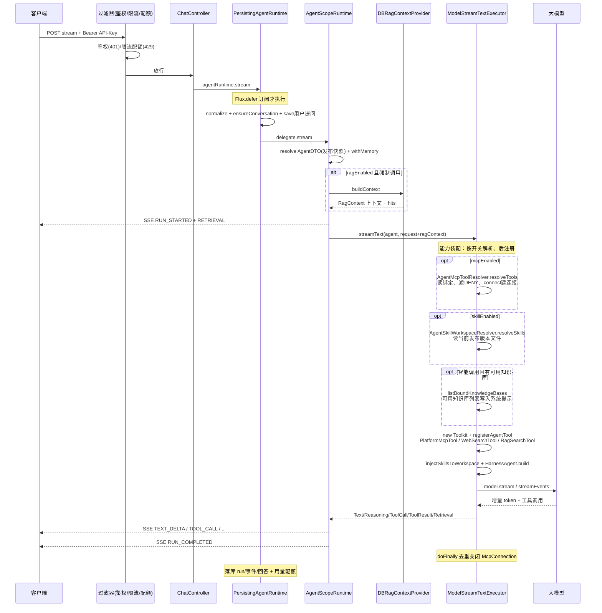
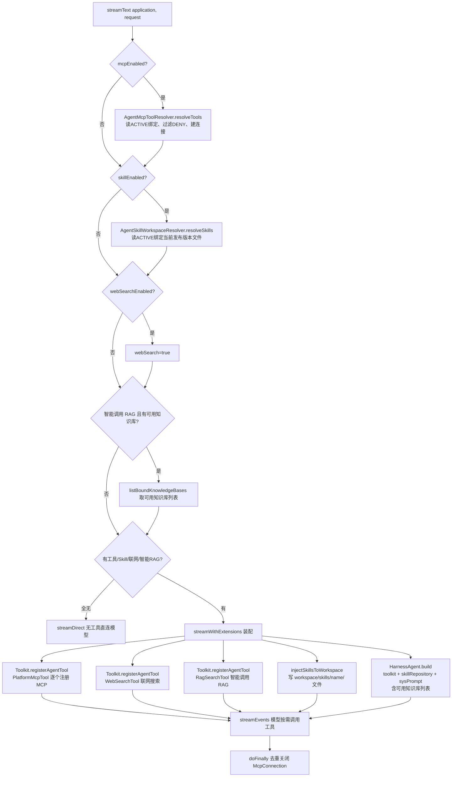
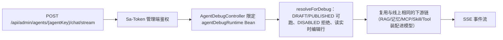

# AGENTS.md

本文件帮助 Agent（人类或 AI）快速理解 `v5ai-nb` 项目：架构、模块、关键约定、构建方式与常见任务入口。详细设计见 `docs/superpowers/specs/2026-08-12-v5ai-nb-design.md`，API 契约见 `docs/api/phase*.md`。

## 1. 项目概览

`v5ai-nb` 是一个**中心化 AI 应用平台**（Dify 风格），基于 JDK 21 + Spring Boot 4.1.0（WebFlux）+ AgentScope Java 2.0 构建。平台统一管理模型、Agent、知识库（RAG）、MCP Server、Skill、会话与运行记录；运行时根据已发布的 Agent 配置动态构造 AgentScope Agent，通过 HTTP/SSE 对外提供对话能力。

**明确的架构决策**：
- 不使用 Server-Agent / gRPC 架构（中心化单体 + 异步 Worker）。
- 不依赖、不复用 `snail-ai` 的源码/数据库表/API 契约（本项目为全新独立实现）。
- 模块化单体（RuoYi-Vue-Plus 风格）：业务模块自包含 MyBatis-Plus 实体/BO/VO/Mapper/Service/Controller；`v5ai-common-*` 提供公共能力（`R`、`PageQuery`、`PageResult`、`QueryBuilder`、`BaseMapperPlus`、`MapstructUtils`、`CredentialCipher` 等）；`v5ai-infrastructure` 只保留跨模块的运行时/平台实现与 Flyway 迁移。

**当前阶段**：Phase 1（模型与 Agent 闭环）、Phase 2（RAG）、Phase 3（MCP）、Phase 4（Skill）、Phase 5（平台增强：RBAC/配额/限流/用量/审计/菜单）均已完成；**Workflow（工作流）为当前进行中的下一阶段**（模块与基础 API 已落地，可视化编辑器与运行时闭环待完善）。

## 2. 技术基线

| 组件 | 版本/说明 |
|---|---|
| JDK | 21（`maven.compiler.release=21`） |
| Spring Boot | 4.1.0（Servlet MVC 栈，非 WebFlux；响应式仅用于运行时事件流/SSE） |
| ORM | MyBatis-Plus 3.5.12（显式装配 `SqlSessionFactory` 以兼容 Spring Boot 4） |
| 数据库 | PostgreSQL 14+ + pgvector（默认）**或** MySQL 8.0.17+，由 `V5AI_DB_DIALECT` 切换（见 `docs/adr/0012`）。向量检索走独立「存储实例」（pgvector / Milvus / ES），MySQL 部署下不占业务库 |
| 认证 | Sa-Token 1.44.0 + JWT（`is-concurrent: false`，token 前缀 `Bearer`） |
| 加密 | BCrypt（API Key / 密码）、AES-GCM（模型凭据） |
| 运行时 | AgentScope Java 2.0（`agentscope-harness`、`extensions-model-openai/gemini/anthropic`） |
| PDF 解析 | PDFBox 3.0.7 |
| 前端 | Vue 3.5 + Vite 7 + TypeScript 5.9 + Naive UI 2.43 + Pinia + Vue Router 4 |
| 可选中间件 | Redis（Redisson）、MinIO（当前业务未强制使用） |

## 3. Maven 模块与依赖方向

根包名 `xin.v5ai.nb`，模块前缀 `v5ai-*`。依赖方向严格单向：

```
common ← model ← mcp
common ← agent ← skill
common ← rag ← worker
common + agent + mcp + skill ← runtime ← workflow
common + model + runtime + rag + mcp + skill + workflow + agent ← infrastructure（跨模块运行时/平台实现）
全部 ← api（管理/运行 API 与剩余 Web 装配）
api + infrastructure + worker ← starter（Spring Boot 启动入口）
```

| 模块 | 职责 |
|---|---|
| `v5ai-common` | 公共能力：统一响应（`R`）、异常（`V5aiException`/`ErrorCode`）、分页（`PageQuery`/`PageResult`）、MyBatis-Plus 扩展（`BaseMapperPlus`/`QueryBuilder`）、加解密（`CredentialCipher`）、API Key 校验端口（`AgentApiKeysVerifier`）、平台领域（用户/角色/菜单/配额/用量/审计/限流端口与模型）；`v5ai-common-agentscope` 承载运行时契约：端口在 `core/service/*`（`AgentService`/`McpToolCallAuditService`），载体在 `core/domain/dto|bo|vo`（`AgentDTO`/`AgentVersionDTO`/`AgentRunBo`/`AgentRunVo`/`SessionMessage`），执行器在 `core/executor/*`（`ModelStreamTextExecutor`/`AgentScopeHarnessExecutor`/`PublishedModelAgentTextExecutor`），内置工具在 `core/tools/*`（`PlatformMcpTool`/`WebSearchTool`/`RagSearchTool`）|
| `v5ai-model` | **自包含模块（新风格的样板）**：`domain` 实体（`V5aiModel`/`V5aiModelProvider`）、`domain/bo`、`domain/vo`、`mapper`（`BaseMapperPlus` + `ModelConfigRetrieve` 端口）、`service`/`service.impl`、`controller`（`/api/admin/models`、`/api/admin/providers`），以及运行时模型链（`runtime/AgentScopeModelFactory`、`runtime/AgentScopeModelConnectionTester`、`runtime/config/*`）。凭据 AES-GCM 加密，支持连通性测试。**删除/禁用模型前按引用拦截**（`verifyNotReferenced` → `V5aiModelMapper.countAgentUsage`），计数必须**同时覆盖 `v5ai_agent.model_id` 与 `secondary_model_id`**——只被当作次要模型引用的模型若漏拦，会表现为该 Agent 的会话标题与摘要**静默失败**（这两条链路 fire-and-forget、无用量无事件，没有任何报错） |
| `v5ai-agent` | **自包含模块**：`domain` 实体（`Agent`/`AgentVersion`）、`domain/bo`（`AgentBo`）、`domain/vo`（`AgentVo`/`AgentVersionVo`）、`mapper`（`BaseMapperPlus` + `AgentCleanupMapper`）、`service`（`IAgentService` 管理服务：创建/更新/草稿/发布/禁用/版本/分页）、`service/impl`（`AgentServiceImpl` 管理实现；`DBAgentServiceImpl`（`@Primary`，MyBatis-Plus）实现 common 的运行时端口 `AgentService`，同类型不再有其他实现以免多候选）、`core`（`AgentConfigGenerator`/`AgentScopeAgentConfigGenerator`：按描述调模型生成配置）、`controller`（`/api/admin/agents`）；级联删除走 `IAgentDeletionPortService`；旧的 `AgentRepository`/`DatabaseAgentRepository`/`InMemoryAgentRepository` 已删除（见 git 历史） |
| `v5ai-runtime` | Agent 运行时装配与持久化边界：`ChatController`（门户运行 / 会话管理 / 停止对话）、`ChatAuthController`（门户初始化与头像代读）、`ChatAttachmentController`（附件上传与读取）、`AgentDebugController`（管理端调试入口，含 `controller/vo`）、`PersistingAgentRuntime`（持久化装饰器，含取消收尾）、`RunCancellationRegistry`（进行中运行的取消信号）、`ConversationSummaryWriter`（历史窗口之外内容的滚动摘要）、`DBModelImageSupportResolver`（模型 image 能力判定）、`ResourceAttachmentContentProvider`（附件字节读取）、`PublishedModelAgentTextExecutor`、`AgentScopeRuntimeConfiguration`（装配执行器与运行时 Bean）、`DBAgentModelResolver`，以及运行期会话/消息/run/run_event/AgentState 的实体 + Mapper + `MyBatis*Repository` + `core/gateway`（实现 common `core/service` 的持久化端口）；运行时端口与事件模型（`AgentService`/`RagContextProvider`/`RagSearchProvider`/`McpToolResolver`/`RuntimeRunEventDTO`/`AgentRunBo`/`AgentRunVo`）定义在 `v5ai-common-agentscope` |
| `v5ai-rag` | **自包含模块**：`domain` 实体（`KnowledgeBase`/`KnowledgeDocument`/`KnowledgeTask`/`AgentKnowledgeBinding`）、`bo`/`vo`、`mapper`（`BaseMapperPlus` + 端口实现 `MyBatis*Repository`）、`service`（`IKnowledgeBaseService`：知识库/文档/任务/绑定/URL 导入）、`controller`（`/api/admin/knowledge-bases`、`knowledge-bindings`）；保留运行时端口（`EmbeddingClient`/`VectorStore`/解析/切片/`RetrievalContextBuilder` 等），实现仍在 infra（PgVectorStore、OpenAiCompatibleEmbeddingClient、解析器） |
| `v5ai-mcp` | **自包含模块**：`domain` 实体（`McpServer`/`McpTool`/`McpToolCallAuditDTO`/`AgentMcpBinding`，headers/env 密文列）、`domain/bo`、`domain/vo`、`mapper`（`BaseMapperPlus`）、`service`（`IMcpServerService`：连接测试、Tool 发现、权限三态、绑定、审计）、`controller`（`/api/admin/mcp-servers`、`/api/admin/mcp-tool-calls`、`agents/{agentKey}/mcp-bindings`）；保留运行时端口（`McpClientFactory`/`McpConnection`/`McpToolInfo`/`StdioCommandPolicy`/`McpToolPermissionPolicy`/`McpToolCallAuditRepository`），实现仍在 `v5ai-infrastructure`（AgentScope 适配） |
| `v5ai-skill` | **自包含模块**：`domain` 实体（`SkillDTO`/`SkillVersion`/`SkillFileDTO`/`AgentSkillBinding`）、`domain/bo`、`domain/vo`、`mapper`（`BaseMapperPlus`）、`service`（`ISkillService`：上传解析、版本发布/回滚、绑定）、`controller`（`/api/admin/skills`、`agents/{agentKey}/skill-bindings`）；保留纯逻辑与运行时端口（`SkillPackageParser`/`SkillFrontmatterParser`/`SkillWorkspaceResolver`/`ResolvedSkill`），`SkillWorkspaceResolver` 实现在 `v5ai-infrastructure` |
| `v5ai-workflow` | **自包含模块（进行中）**：`domain` 实体（`Workflow`/`WorkflowRun`/`WorkflowNodeRun`）、`bo`/`vo`、`mapper`（`BaseMapperPlus` + 运行时端口实现 `MyBatisWorkflowRepository`/`MyBatisWorkflowRunRepository`）、`service`（`IWorkflowService`：草稿/发布/禁用/运行查询）、`controller`（`/api/admin/workflows`）；保留纯逻辑（`WorkflowEngine`/`TemplateResolver`/`ConditionEvaluator`/`WorkflowDefinitionValidator`/`WorkflowJson`） |
| `v5ai-worker` | 文档索引 Worker（异步任务状态机 + `@Scheduled` + 重试） |
| `v5ai-platform` | **自包含平台模块**：auth（`platform.auth`：`AuthController`/`LoginServiceImpl`/`SaTokenWebConfiguration`/`PlmPermissionServiceImpl`，`platform.security`：`PasswordVerifier`/`BCryptPasswordVerifier`/`SaTokenConfiguration`）、apiKey（`platform.apiKey`：Agent API Key 管理/校验/过滤器 + `platform.domain.ApiKey`）、平台业务（`platform.domain`/`mapper`/`service.impl` 端口实现 + `platform.controller` 控制器：users/roles/menus/clients/logs/quota/usage/apiKey）、**db/migration（Flyway 迁移脚本）**；common-core 的平台端口/record 保留为契约 |
| `v5ai-api` | 运行 API（`/api/v1/...` SSE/Chat）、`/api/auth/login` 之外的 Web 装配、`StatsController`/`HealthController`（跨模块聚合与基础设施）、`ApiGlobalExceptionHandler`、`OptionResponse`（model/mcp/skill/agent/rag/workflow 的控制器已移入各自模块，auth/apiKey/平台控制器已移入 `v5ai-platform`） |
| `v5ai-starter` | 启动模块：`V5aiApplication`（`scanBasePackages="xin.v5ai.nb"` + `@MapperScan` + `@EnableScheduling`）、`application.yml` |
| `v5ai-ui` | Vue 3 管理前端（非 Maven 模块） |

## 4. 核心领域概念

- **Provider/Model**：模型供应商与模型配置；凭据 AES-GCM 加密存储；支持连通性测试。Embedding 模型未配置时回退到确定性本地 Hash 嵌入（1536 维）。
- **Agent**：平台核心实体（平台实体类为 `Agent`，运行时契约 record 为 `AgentDTO`；`AgentRunBo`/`AgentRunVo` 分别是运行入参与结果，`SessionMessage` 是会话消息载体）。有草稿/发布/禁用状态；发布时把配置（模型 / 系统提示词 / 能力开关等标量字段）快照到 `v5ai_agent_version.snapshot_json`，线上 `/api/v1` 运行按**发布快照**解析（`PublishedAgentResolver.resolve`），管理端 `/api/admin` 调试按**实时编辑行**解析（`resolveForDebug`），因此编辑未重新发布不影响线上；MCP/Skill/RAG 绑定列表不固化、仍按 `agentKey` 实时解析。5 个能力开关在运行时生效、对 `/api/v1` 与 `/api/admin` 一致：`mcpEnabled`/`skillEnabled` 门控绑定解析（关闭即不加载）、`ragEnabled` 门控知识检索（`ragCallMode` 选择调用方式：1=智能调用，注册 `rag_search` 工具、把可用知识库列表写进系统提示，由 LLM 自主决定是否检索与检索几次；2=强制调用，每次运行前必检索并注入，默认值、兼容存量行为）、`memoryEnabled` 控制按会话自动注入历史（显式 `resume` 历史不覆盖，但同样过历史窗口）、`webSearchEnabled` 注册 Tavily 联网搜索工具（配置 `v5ai.agentscope.tavily-api-key` / 环境变量 `V5AI_TAVILY_API_KEY`，缺 Key 时工具返回错误而非抛异常）。`agentKey` 为对外运行标识；通过 API Key（BCrypt 存储）鉴权。
- **会话/消息/run/run_event/AgentState**：运行时持久化对象。对话历史与恢复基于这些表。会话的**归属主体是 API Key**（`v5ai_conversation.api_key_id`，见 `docs/adr/0006-api-key-scoped-conversations.md`）：门户侧的列表/改名/归档、消息与附件读取都以它判定，`user_id` 只是展示与审计冗余；调试入口产生的会话该列为 NULL，因而不出现在门户列表里。会话的**名称在写入侧生成**：创建时取首条提问的首行落库（`ConversationNaming.fromQuery`，≤100 字符），首轮结束后异步调一次模型改写成 ≤30 字短标题（`ConversationTitleWriter`，配置 `v5ai.chat.conversation-title`）；标题与会话摘要用的模型取自 Agent 的**次要模型**，未配置则回退其绑定的对话模型（`AuxiliaryModel`，两级回退、无全局配置项，见 `docs/adr/0010-agent-secondary-model.md`）；`v5ai_conversation.name_source` 区分 `AUTO`（可被模型改写）与 `USER`（用户改名后冻结），因此门户列表只读会话表，不再回查消息表取预览。会话可命名、可归档（归档后禁止继续对话 → 409）。消息可携带**图片附件**（`v5ai_message_attachment`，指向 `plm_resource` 的 ATTACHMENT 资源），附件是否可用由所绑 CHAT 模型的 `config.capabilities` 是否含 `image` 决定。消息有「**作废**」软状态（`v5ai_message.superseded_at`）：被「重新生成」替换的消息保留数据但不参与展示与记忆回放；读取侧只在 `findByConversationId` 一处过滤（附件读取的推导式鉴权**刻意不过滤**——那是归属判定，不是展示查询；会话列表的预览查询已在 V40 一并删除）。
- **思考（Reasoning）持久化**：模型思考随**所属助手消息**落库（`v5ai_message.reasoning`，仅助手消息有值；被停止/失败时连半截一起保留；`NULL` = 没有思考或 V42 之前的数据），门户历史回放据此折叠展示（`ChatMessageBody.vue` 复用实时流那套组件；「只思考就被停止」的那一轮也算有内容、不再被前端过滤跳过）。它**只供回看**：不进模型上下文、不占历史窗口预算、也不进会话摘要，因此**记忆窗口与摘要的取数显式剔除该列**（`RuntimeMessageServiceImpl.HOT_PATH_EXCLUDED_COLUMNS`，否则每轮都会白读一屏大文本）；运行事件表 `v5ai_run_event` 仍不落思考（会随思考长度膨胀）。开关 `v5ai.agentscope.reasoning-persist-enabled`（默认开，关掉后照常流式推送但不落库）。见 `docs/adr/0007-reasoning-persisted-but-not-replayed.md`。同一批的 `v5ai_message.metadata` 是**保留列**：V42 只建列、语义待定，当前没有写入方与读取方。
- **同会话上下文治理（历史窗口 / 会话摘要 / 用量口径）**：一次运行发给模型的历史由三道机制共同决定。①**历史窗口**（`v5ai.agentscope.history`，默认 40 条 / 8000 字符 / 保底 2 条 / 首条对齐用户提问）：`AgentScopeRuntime.withMemory` 按窗口的 `fetchLimit()` 在 SQL 层取最近若干条（`MessageService.findRecentByConversationId`），剔除尾部当前提问后由 `HistoryWindow` 纯函数裁剪；**显式 `resume` 传入的历史同样过这一道**（否则它就是绕过预算的后门）。裁剪统计（kept/dropped 条数与字符数）随 `RUN_STARTED` 载荷发出，`PersistingAgentRuntime` 只补 `userMessageId` 字段、不整体替换载荷。②**会话摘要**：窗口之外的旧内容由 `ConversationSummaryWriter` 异步压缩成一段文本存进 `v5ai_conversation_summary`（一会话一行、水位 `covered_until_message_id` 只增不减），下次运行经 `AgentRunBo.summaryContext` 拼进系统提示（与 RAG 上下文同一处、两条执行路径共用）；「重新生成」作废了摘要覆盖范围内的内容时整条摘要失效。③**用量口径**：模型回报的真实用量优先（直连路径读 `ChatResponse.getUsage()`、工具路径累加 `ModelCallEndEvent.getUsage()`），服务端没回报时回退为平台估算（CJK 1 字 1 token、其余 4 字符 1 token、图片按张计 `v5ai.agentscope.image-tokens-per-image`）；三个出口（`RUN_COMPLETED` 载荷、助手消息三列、`v5ai_model_usage` + 配额）永远同源。用量传递走内部事件 `MODEL_USAGE`：由执行器发出、`PersistingAgentRuntime` 消费后过滤，**不落库、不推前端**。
- **MCP**：Server 注册（Streamable HTTP / SSE / Stdio，headers/env 加密），连接测试 → Tool 发现与缓存 → Agent 绑定 → 运行时动态注册为 AgentScope Toolkit。**必须先"发现工具"再绑定发布**。Tool 权限三态 ALLOW/APPROVE/DENY，调用审计（runId/工具名/参数摘要/状态/耗时）。Stdio 命令受白名单限制（生产必配 `V5AI_MCP_STDIO_COMMAND_WHITELIST`）。
- **Skill**：zip 包上传（SKILL.md frontmatter 校验、路径穿越/大小/编码校验）→ DRAFT 版本 → 发布为当前版本（回滚改变当前版本）→ Agent 绑定 → 运行时注入 Workspace（`skills/<name>/` + 只读 Skill 仓库 `<available_skills>`）。
- **Workflow**（进行中）：节点/边定义、条件求值、模板解析、运行状态机（见 `v5ai-workflow`）。

## 5. 运行时事件流（RuntimeEventType）

一次 Agent 运行的完整事件序列（SSE 推送，顺序）：

```
RUN_STARTED → MODEL_CALL → (TEXT_DELTA | TOOL_CALL → TOOL_RESULT | RETRIEVAL)*
            → MESSAGE_COMPLETED → RUN_COMPLETED
失败路径：RUN_FAILED；需授权：PERMISSION_REQUIRED；调用方停止：run 状态置 CANCELED（不额外发事件，已生成的部分回答照常落库）；RUN_STARTED 的载荷是本轮提问的消息 id + 本轮上下文窗口统计（`{userMessageId, context:{keptMessages,droppedMessages,droppedChars,keptChars,trimmed}}`，无记忆时为 `""`）、RUN_COMPLETED 的载荷是本次运行的用量汇总（真实 token 优先、估算兜底 + 耗时），前端「重新生成的锚点」与「用量/用时」分别读它们。此外执行器还会发平台内部事件 `MODEL_USAGE`（用量真实值/估算值，见 §4 用量口径）：它由 `PersistingAgentRuntime` 消费后**从流里过滤掉**，既不落 `v5ai_run_event` 也不出现在 SSE 里
```

`RETRIEVAL` 的位置取决于 RAG 调用方式：**强制调用**在模型调用前发出（pre-step 检索注入）；**智能调用**在 `rag_search` 的 `TOOL_RESULT` 之后追加。

实现链：`ChatController` → `AgentRuntime`（入参 `AgentRunBo`、结果 `AgentRunVo`；默认实现 `AgentScopeRuntime`）→ `PersistingAgentRuntime`（持久化装饰器）→ `AgentScopeHarnessExecutor`/`ModelStreamTextExecutor`（模型执行器）。

端到端流式链路（`/api/v1/agents/{agentKey}/chat/stream`，RAG / 记忆 / MCP / Skill / Tool 装配的先后关系）：



能力装配内部（`ModelStreamTextExecutor`，`mcpEnabled` / `skillEnabled` / `webSearchEnabled` / 智能调用 RAG 分派）：



管理端调试链路 `/api/admin/agents/{agentKey}/chat/stream`（`resolveForDebug` 草稿态）：



与线上差异：鉴权用 Sa-Token（不用 API Key、不经 `AgentApiKeysServletFilter` 的限流/配额），Agent 解析用 `resolveForDebug`（实时编辑行，DRAFT/PUBLISHED 可跑、DISABLED 拒绝）；下游装配链（RAG/记忆/MCP/Skill/Tool → 模型 → SSE）与线上 `/api/v1` 完全相同。**入参与线上同形（`ChatBo`）**：图片附件与 MCP/Skill 收窄项都原样进运行时，模型不支持图片时同样 400；预览面板的图片按钮是真实的文件选择 + 上传（先传资源再随消息提交引用）。

## 6. API 概览

- **认证**：`POST /api/auth/login`（默认管理员 `admin/admin`，启动时自动种子）。管理 API 强制登录，写操作需 admin 角色。
- **管理 API**：`/api/admin/...`（providers、models、agents、knowledge-bases、mcp-servers、skills、workflows、users、roles、menus、clients、logs、quota、usage、stats）。
- **运行 API**：`/api/v1/agents/{agentKey}/chat/stream`（SSE）与 `/api/v1/agents/{agentKey}/chat`（一次性），用 Agent API Key 鉴权（Header `Authorization: Bearer <api-key>`），按应用配额/每分钟限流（超限 429）。
- **对话门户 API**（同样用 API Key）：会话列表/改名/归档 `GET|PATCH /api/v1/agents/{agentKey}/chat/conversations[/{id}]`、停止运行 `POST /api/v1/agents/{agentKey}/chat/runs/{runId}/stop`、重新生成 `POST /api/v1/agents/{agentKey}/chat/conversations/{id}/regenerate`、附件上传 `POST /api/v1/agents/resource/upload` 与读取 `GET /api/v1/agents/attachments/{id}`。契约见 `docs/api/phase6.md`。
- **健康检查**：`/api/health`。

各阶段 API 细节见 `docs/api/phase1.md` ~ `phase6.md`（phase6 为对话门户：附件与多模态、会话管理、停止对话）。

## 7. 数据库与迁移

- 迁移脚本位于 `v5ai-platform/src/main/resources/db/migration/`，**按方言分三个目录**：`common/`（两方言通用）、`postgresql/`（既有 V1–V49）、`mysql/`（`V1__baseline_schema.sql` + `V2__baseline_seed.sql`，从当前 head 全量基线起步）。加载哪套由 `V5AI_DB_DIALECT`（默认 postgresql）决定：`spring.flyway.locations: classpath:db/migration/common,classpath:db/migration/${v5ai.db.dialect}`。命名 `V<n>__<name>.sql`，Flyway 管理（表 `v5ai_flyway_schema_history`）。
- **同一版本号在一个方言下只能出现一次**：要么只在 `common/`（写法必须 PG/MySQL 都成立），要么在 `postgresql/` 与 `mysql/` 各写一份同号。下一个新迁移从 **V51** 起号。运行时 SQL 的方言分支不用配置项——`_databaseId`（由 `VendorDatabaseIdProvider` 按连接元数据识别）与 `DataBaseHelper` 自动判定，mapper 里 `<when test="_databaseId == 'mysql'">`；**新增 PG 专有 SQL 时必须同时给 MySQL 分支**，否则 MySQL 部署静默走错方言。取舍与坑（as_cs 排序规则、DATETIME(3) 无时区、`ON DUPLICATE KEY UPDATE` 赋值顺序、InnoDB 外键自动建索引、8.0.17 下限）见 `docs/adr/0012-multi-dialect-database-support.md`。
- **迁移历史已冻结于 V41**（2026-09-19）：V1–V41 只增不改，逐版本做了什么见 `v5ai-platform/src/main/resources/db/migration/README.md`；V42 起继续递增（V43 补齐列/表注释、V44 删除遗留死表 `v5ai_agent_model`）。
- **想读懂当前 schema，不要 replay 历史文件**：直接看 `docs/db/schema.md`（迁移头的全貌 + 每列注释）。它是快照，新增迁移后按 `docs/db/dump-schema.sql` 重新生成；决策取舍见 `docs/adr/0008-migration-history-frozen.md`。
- 所有表以 `v5ai_` 前缀。运行时表 UUID 列使用 VARCHAR（避免 `uuid = character varying` 报错）。
- 需要 pgvector 扩展（`CREATE EXTENSION IF NOT EXISTS vector` 在迁移中幂等执行）。
- 添加新表/改列时**必须新增一个递增的 V 版本迁移**，不要修改已应用的历史迁移。
- Docker 部署按方言拆成两份 Compose（`script/docker/docker-compose-postgresql.yml` 装 postgres、`docker-compose-mysql.yml` 装 mysql，各自都带 redis + v5ai + nginx），同一时刻只跑一份，用法见 README「Docker Compose 部署」。

## 8. 前端（v5ai-ui）

- Vue 3 + Vite 7 + TypeScript + Naive UI + Pinia + Vue Router。
- 结构：`src/api/client.ts`（API 类型与客户端）、`src/views/`（每页一个视图：Login、Dashboard、Agents、Models、KnowledgeBases、McpServers、Skills、Workflows、WorkflowEditor、UserManagement、RoleManagement、MenuManagement、ClientManagement、LogManagement、Observability、ChatDebug、Settings）、`src/router/index.ts`、`src/stores/`（session、theme）。
- 构建：`cd v5ai-ui && npm install && npm run build`（产物在 `dist/`）。
- **独立对话门户**：`v5ai-ui-chat/`（Vue 3 + Vite 独立项目，终端用户用 API Key 登录：初始化 `GET /api/v1/agents/auth/bootstrap`（含 `imageSupported` / `showCitations`）、Agent 头像 `GET /api/v1/agents/auth/{agentKey}/avatar`、对话复用 `/api/v1/agents/{agentKey}/chat/stream`）；构建 `cd v5ai-ui-chat && npm install && npm run build`；管理端「系统信息」页在 `VITE_CHAT_UI_URL` 配置时显示入口。
  - 会话列表 / 改名 / 归档**都在服务端**（`GET|PATCH /api/v1/agents/{agentKey}/chat/conversations…`），本地只保留 API Key、当前 Agent 与头像缓存；旧的 localStorage 会话列表（`v5ai_chat_sessions`）已废弃并在登录时清理。列表里的会话名也由服务端生成（创建时取首条提问、首轮后可能被模型改写），客户端不再有「首条提问预览」兜底（`preview` 字段已移除）。
  - 图片附件先上传（`POST /api/v1/agents/resource/upload`，JSON + base64）拿资源 id，再随消息提交；消息里的图片走「带 Authorization 取 blob → objectURL」渲染（`` 带不了鉴权头，与头像同一手法）。附件入口由 bootstrap 的 `imageSupported` 控制——**注意它的两个坑**：①判定对象是**发布快照**里的 `modelId`（`PublishedAgentResolver.resolve`），而 `config.capabilities` 按模型 ID 实时读，所以给模型开启「支持图片输入」无需重新发布即可生效，但**给 Agent 换绑定模型后必须重新发布**，否则门户仍按旧快照的模型判定（管理端调试走 `resolveForDebug`，用实时编辑行，不受此限）；②`imageSupported` 每次进页面随 bootstrap 只取一次，改完模型/能力需**刷新页面（或重登）**。管理端「预览与调试」面板用的是所选模型的实时 config，不受①限制。
  - **「引用展示」开关（`v5ai_agent.show_citations`，默认开）**：随发布快照下发门户，只决定助手消息下方「引用（N 条）」折叠块**画不画**，是**纯展示**开关——检索照常、`RETRIEVAL` 事件照常推、引用照常随消息落库（ADR-0009 的不变量不破，见 `docs/adr/0011-citations-toggle-is-display-only.md`）。它**同样作用于管理端「预览与调试」**（`PreviewPanel` 传 `form.showCitations`；调试面走 `resolveForDebug`，改完当场可见、不必先发布，`showCitations=false` 时面板另给一句提示，以免把「未展示」误读成「未命中」）；知识库「知识问答」tab 没有 Agent 上下文，不受影响。两处渲染组件是**两份独立副本**（`v5ai-ui-chat/` 与 `v5ai-ui/` 各一份 `ChatMessageBody.vue`），`showCitations` prop 的默认值在两处**必须都是 `true`**（未传即展示＝改动前行为），改动时两处同改。
  - **生效时机（`showCitations` 与「次要模型」共用这套坑，改文档时一并核对）**：①门户读的是**发布快照**（`PublishedAgentResolver.resolve`），改完引用的开关或次要模型**必须重新发布**才对外生效；管理端调试走 `resolveForDebug`（实时编辑行）不受此限，这也是「调试页能看到效果」的前提。②bootstrap 每个页面加载**只取一次**，发布后终端用户需**刷新页面（或重登）**才拿到新值。
  - **「次要模型」的保存语义与其它 Agent 字段不同**：`AgentBo.secondaryModelId` 为 `null` 表示**清除**（回退绑定的对话模型），而不是「null 即不改」；这是唯一一个可清除的模型字段，理由与实现（MyBatis-Plus `NOT_NULL` 策略下 `updateById` 写不进 null，故走单独一条 `AgentMapper#clearSecondaryModel`）见 `docs/次要模型与引用展示开关实现方案.md` §3.6 与 `docs/adr/0010-agent-secondary-model.md`。**改 `updateAgent` 的调用方时必须保持「整体提交」**——一旦有人只提交差异字段，这个字段就会被误清。
  - 停止生成同时做两件事：调 `POST …/chat/runs/{runId}/stop`（幂等）+ `AbortController.abort()`。
  - **主题与视觉令牌**：深浅双主题，`src/stores/theme.ts` 维护 `light|dark|system`（localStorage 键 `v5ai_chat_theme`），落到 `<html data-theme>`；颜色一律取 `src/styles/base.css` 的 `--portal-*` 语义令牌（组件里不写死 hex），Naive 侧由 `App.vue` 的 `darkTheme` + `theme-overrides` 对齐同一套品牌色。索引 `index.html` 里有一段首屏内联脚本先一步写 `data-theme`，避免深色用户闪白屏。
  - **左栏可拖拽调宽**：`ChatView.vue` 的 `.sidebar-resizer`（pointer 拖拽，clamp 200–420px，localStorage 键 `v5ai_chat_sidebar_width`，双击复位，聚焦后 ←/→ 调整，`role="separator"`）；窄屏（≤768px）侧栏与把手一并隐藏。
- **Naive UI 表格横向滚动约定**：`n-data-table` 是否出现横向滚动条取决于「列是否带 `ellipsis`」。任一列配置 `ellipsis` 时，Naive UI 会把表格切为 `table-layout: fixed`（源码 `DataTable.mjs` 的 `mergedTableLayoutRef`：`virtualScroll || flexHeight || maxHeight !== undefined || hasEllipsis` → `fixed`）；fixed 布局下**只有显式绑定 `:scroll-x="列宽总和"` 才会出现横向滚动条**，否则列宽被压缩而不滚动。反之，无 `ellipsis` 的表格保持 `table-layout: auto`，内容超宽时会自动横向滚动、无需 `scroll-x`（例：`StoreInstancesView.vue`）。因此约定：**列一旦用 `ellipsis`，就必须同时给 `:scroll-x`**，列宽总和用 `columns.reduce((s, c) => s + (typeof c.width === 'number' ? c.width : 240), 0)` 计算，参考 `WorkflowsView.vue` / `SkillsView.vue` / `ModelsView.vue`。

## 9. 构建与本地运行

```bash
# 后端（用本地仓库避免下载污染）
mvn -Dmaven.repo.local=/private/tmp/v5ai-m2 clean verify -Dmaven.test.skip=false -Dsurefire.failIfNoSpecifiedTests=false

# 前端
cd v5ai-ui && npm install && npm run build
```

前置条件：PostgreSQL + pgvector（库 `v5ai_nb`），环境变量参考 `.env.example`（`V5AI_DATASOURCE_URL`、`V5AI_DATASOURCE_USERNAME`、`V5AI_DATASOURCE_PASSWORD`、`V5AI_JWT_SECRET`、`V5AI_CREDENTIAL_CIPHER_KEY`，可选 Redis/MinIO/上传大小/超时/MCP 白名单）。开发配置模板：`v5ai-starter/src/main/resources/application-dev.yml.template`。

端到端验证步骤（登录 → 配模型 → 建 Agent → 生成 API Key → 建知识库/绑文档 → 建 MCP/发现工具/绑定 → 传 Skill/发布/绑定 → 流式对话）见 README「本地验证」。

## 10. 测试约定

- 61 个测试类，JUnit 5 + Mockito（各模块 `src/test/resources/mockito-extensions/` 提供 mockito 扩展）+ Reactor `StepVerifier`。
- 单测策略：领域模块与基础设施组件以纯单测为主；`v5ai-starter` 含集成测试（`src/test/resources/db/testmigration`、`db/idtest` 提供测试迁移/ID 方案）。
- 构建命令中 `-Dsurefire.failIfNoSpecifiedTests=false` 允许模块无测试时通过。
- 运行测试：`mvn test -Dmaven.test.skip=false`（在根或指定模块执行）。根 pom 默认 `<maven.test.skip>true</maven.test.skip>`（打包默认跳过测试），**不加这个参数 surefire 会「成功退出但一个用例都没跑」**，很容易误判为通过。

## 11. 代码风格与约定

- 包结构：`xin.v5ai.nb.<module>`，业务模块内部按 `domain`（实体）/`domain.bo`/`domain.vo`/`mapper`/`service`/`service.impl`/`controller` 组织（参考 `v5ai-model`，代码生成器在 `v5ai-modules/v5ai-code-generator`）；`v5ai-platform` 按 `auth`/`apiKey`/`security`/`domain`/`mapper`/`service.impl`/`controller` 组织；基础设施按 `infrastructure/<能力>` 组织（mybatis、redis、storage、runtime、agent、mcp、rag、skill、reactor）。
- 业务模块的 CRUD 采用 MyBatis-Plus 风格：实体继承 `common.mybatis.core.domain.BaseEntity`（`@TableName`/`@TableId`），BO 用 `@AutoMapper(target = Entity.class, reverseConvertGenerate = false)`，VO 用 `@AutoMapper(target = Entity.class)`，Mapper 继承 `BaseMapperPlus<Entity, Vo>`，查询用 `QueryBuilder.lambda(...)` + `selectVoPage/selectVoList`，分页统一 `PageQuery`/`PageResult`，转换用 `MapstructUtils.convert`，控制器继承 `common.web.core.BaseController` 并返回 `R<T>`。
- 跨模块的运行时/平台实现仍放 `v5ai-infrastructure`，通过 Spring 依赖注入装配。
- API 层的请求/响应体使用不可变 record（见 git log `feat(api): 添加不可变请求和响应体记录类型`）。
- 运行时契约的载体命名与分层：跨层传输用 `...DTO`（`AgentDTO`/`AgentVersionDTO`），入参用 `...Bo`（`AgentRunBo`），出参用 `...Vo`（`AgentRunVo`）；`v5ai-common-agentscope` 内按 `core/domain/{dto,bo,vo}` 分层，运行时端口统一放 `core/service`（如 `AgentService`）。
- 响应统一包装 `R`（`common.core.domain.R`）；错误统一走 `V5aiException` + `ErrorCode`。
- 运行时相关代码保持响应式（`Flux`/`Mono`）；Web 层为 Servlet MVC（上传用 `MultipartFile`，SSE 用 `ServerSentEvent`）。
- 提交信息使用 conventional commits（feat/fix/refactor/chore 等，中文描述）。
- 数据库迁移只增不改（历史冻结于 V41，见 §7 与 `docs/adr/0008-migration-history-frozen.md`）；新增能力要配套：业务模块（entity/BO/VO/mapper/service/controller）或基础设施实现 + UI + 迁移脚本 + 测试 + docs/api 文档。

## 12. 文档索引

| 文档 | 内容 |
|---|---|
| `docs/superpowers/specs/2026-08-12-v5ai-nb-design.md` | 总体设计（架构、模块、命名约束） |
| `docs/superpowers/plans/*.md` | 各阶段实施计划 |
| `docs/会话名称命名设计方案.md` | 会话名称自动生成（创建时兜底 + 首轮后模型改写）设计 |
| `docs/同会话短期记忆实现方案.md` | 同会话记忆实现（真实 token 计数 / 历史窗口裁剪 / 窗口外滚动摘要）|
| `docs/次要模型与引用展示开关实现方案.md` | Agent 次要模型（会话标题/摘要的内部调用，两级回退链）+ 「引用展示」纯展示开关（含实现状态与测试覆盖缺口）|
| `docs/adr/0001` ~ `0011` | 架构决策记录（ADR）：资源访问地址、文档来源、解析器、切分策略、RAG 调用方式、API Key 归属会话、思考只存不回放、迁移历史冻结、引用随消息落库、Agent 次要模型、引用开关为纯展示 |
| `docs/api/phase1.md` ~ `phase6.md` | 各阶段 API 契约（phase6 = 对话门户） |
| `docs/phase*-verification*.md` | 各阶段验证报告 |
| `docs/deploy/dev.md` | 开发环境部署（PostgreSQL/pgvector/Redis/MinIO 安装与配置） |

## 13. 工作流约定（重要）

**开发新功能/较大改动前，必须先输出实现方案供用户确认，确认后才开始编码。**

流程：
1. 理解需求（复述理解 + 列出约束与不确定点）；
2. 输出方案（涉及文件、改动点、数据库迁移、API 变更、风险）；
3. 等待用户确认；
4. 确认后才写代码。

- 小改动（bug 修复、字段调整、样式微调）可跳过方案直接实现；
- 需求模糊时优先提问澄清，而不是猜测实现；
- 可在对话中输入 `/plan <需求>` 触发项目级方案模板（`.pi/prompts/plan.md`）。

## 14. 常见任务入口（给 Agent 的提示）

- **加一个新管理实体**（如某种资源）：按 `v5ai-model` 样板，在业务模块内补 `domain` 实体 + `domain/bo` + `domain/vo` + `mapper`（`BaseMapperPlus`）+ `service`/`service.impl` + `controller`（`@RequestMapping("/api/admin/...")`）→ 新增 Flyway 迁移 → ui 加 view/路由 → 写测试与 docs/api。
- **改模型/Provider 管理**：入口在 `v5ai-model`（`V5aiModelMapper`/`V5aiModelProviderMapper`/`IV5aiModelService`/`V5aiModelController`）；运行时模型链（`AgentScopeModelFactory`/`AgentScopeModelConnectionTester`/`ModelConfigRetrieve`）也在 `v5ai-model/runtime`。
- **改运行时行为**：运行时契约与端口在 `v5ai-common-agentscope`（`AgentRuntime`（入参 `AgentRunBo`/结果 `AgentRunVo`）、`core/executor/*` 执行器、`RuntimeRunEventDTO`、`core/service` 端口），装配与持久化在 `v5ai-runtime`（`AgentScopeRuntimeConfiguration`、`PersistingAgentRuntime`、`core/mapper` 的 `MyBatis*Repository`）。
- **MCP/Skill 运行时集成**：接口在 `v5ai-common-agentscope`（`McpToolResolver`、`SkillWorkspaceResolver`、`ResolvedSkillAgentSkillRepository`），实现与 AgentScope 适配在 `v5ai-infrastructure`（runtime/mcp/skill）。
- **继续 Workflow 阶段**：先读 `v5ai-workflow` 模块与 `docs/api/phase5.md`/迁移 V12，当前只有领域与基础 API，可视化编辑器与完整执行闭环待完成。
- **注意历史遗留命名**：代码/文档中可能残留 `Application` 字样（V8 迁移前概念），新代码一律用 `AgentDTO`。

## Agent skills

### Issue tracker

Issues live in the repo's OneDev Issues (`https://onedev.v5ai.xin/v5ai-nb`), read/written via the OneDev REST API with a personal access token. See `docs/agents/issue-tracker.md`.

### Triage labels

Five canonical triage roles + five wayfinder labels, default vocabulary (`needs-triage` / `needs-info` / `ready-for-agent` / `ready-for-human` / `wontfix`, plus `wayfinder:map` / `wayfinder:research` / `wayfinder:prototype` / `wayfinder:grilling` / `wayfinder:task`). See `docs/agents/triage-labels.md`.

### Domain docs

Single-context: one `CONTEXT.md` + `docs/adr/` at the repo root. See `docs/agents/domain.md`.

<!-- aoci:begin -->
## AOCI 仓库认知

AOCI 为本仓库维护一个稳定、可版本化、可增量更新的仓库级认知层，供模型跨任务复用对系统的理解。

`aoci.txt` 是面向模型的结构化认知索引。它以每个受管理文件、数据库表或其他受管理对象一条独立 Entry 的方式，用符号标签与 F/R/A/S 语义表达对象的核心职责、重要关系、对外契约，以及理解或修改系统时必须知道的非显然约束和设计决策。

Header、目录段和全部 Entry 共同组成完整仓库索引，可以覆盖前端、后端、配置、数据库结构及其他受管理内容。受管理内容发生变化时，通常只需维护受影响的认知条目，不需要重新生成整个索引。

AOCI 提供系统架构、对象职责、重要关系、对外契约和关键约束的高密度视图。

### 工作原理

AOCI 采用“模型生成、模型读取”的认知闭环。

Header、Entry 和 Curation 语义的创作只按当前机器签发的 Plan 与实时 Guide 执行；由 Host 模型基于当前绑定证据独立完成。

Entry 的语义必须来自模型对真实证据的理解。不得仅依据路径、文件名、扩展名、AST、符号列表、依赖扫描、正则、固定模板或规则引擎推导、预填、拼接或改写索引语义。

对 Fresh Bootstrap，只按当前机器签发的 Plan 和实时 Guide 执行。当它们要求创作时，Host 模型创作 Root、Meta、Tag 和 F/R/A/S，提供 authoring-run 声明，并把它绑定到 Plan、Evidence 与完整 Candidate。不得要求 AOCI 填写 `origin=host_model`、制造 Receipt 或把程序生成的 Framework 当作语义。本文件不自行重建 Onboarding 流程。内部批次不是用户决策；只有遇到既有批准边界或真实的安全、漂移、CAS、Recovery 条件才停止。

### 最小使用入口

- `aoci_rules`：取得当前AOCI版本的会话运行合同。
- `aoci_overview`：建立或恢复本仓库的完整认知。
- `aoci_maintain`：受管理对象达到最终稳定状态后检查认知是否需要维护。
- `aoci_update_entry`：提交与当前证据和源码摘要绑定的完整语义更新批次。
- `aoci_report`：仅当当前布局和工具状态支持时，在证据不足、无法可靠生成语义时登记待办，不猜写。

其他MCP工具、CLI命令、参数和专项流程，以当前工具说明、Guide和 `--help` 返回内容为准，不在本文件中重复完整手册。

本区块只规定仓库接入、认知使用和收尾原则。`aoci_rules` 承载当前会话合同，Guide实时输出承载当前Plan的执行顺序与停点，工具Schema、Spec和Validator承载机器结构与判据；Prompt、Description、README和静态文档不能覆盖这些机器事实。

### 建立、生成和恢复认知

1. 每个新的 Agent Run 开始时，应先判断：

   - 本仓库是否已经存在可用的完整AOCI索引；
   - 当前上下文中是否已有与本仓库根、当前索引版本和当前AOCI服务相匹配，并且模型仍可可靠使用的完整仓库认知。

2. 仓库已经存在可用的完整索引，但当前Run没有可靠完整认知时，先调用 `aoci_rules`，再调用 `aoci_overview`。

   完整认知仍可靠时直接复用。局部不确定本身不要求机械重读系统全貌。

   本Run从已知Host上下文压缩恢复时（包括宿主注入的压缩摘要），必须把此前模型认知视为不可靠。压缩handoff不得保留或摘要正式Whole-Index，也不得保留或摘要任何Overview Header、Entry、Chunk、Challenge或Attestation正文；只能保留安全续接所需的receipt身份、未完成write或Recovery状态，以及立即重载指令。复制进handoff的Whole-Index语义或receipt不能证明恢复后模型的当前认知可靠。若当前上下文已无法可靠保留运行合同，先调用 `aoci_rules`。继续业务任务前，使用 `refresh_reasons=["context_compaction"]` 和新的 `refresh_event_id` 调用普通完整Whole-Index `aoci_overview`（不设置 `check_only` 或设为false）；不得使用 `check_only` 或认知probe。原样跟随每个 `next_cursor` 直到 `completed=true`，确认交付，并且只基于新交付正文提交一次Attestation。完成这次新的完整传输后，即使Attestation为partial或fail也消费该generation，并按既有合同继续source-bound任务，不再自动调用第二次Overview。

   AOCI可以针对 `context_compaction`、项目 `cognition_refresh_threshold` 下的机器 `semantic_threshold` 或主要 `phase_transition` 提供checkpoint与认知状态事实。只需要这些紧凑事实时使用 `check_only=true`；这些事实只向Agent提供建议，不替模型决定是否需要系统全貌。

   Agent显式调用普通 `aoci_overview`（未设置 `check_only` 或为false）时，只要能形成一致的CognitionSet，AOCI必须完整交付请求scope。不得因为已有receipt、阈值未达到或没有待处理刷新原因而抑制正文。正式认知Dirty或Stale时仍交付正文，但必须标记不可靠。存在未决恢复或无法形成一致snapshot时失败关闭，不返回混合正文。

   普通Overview返回 `continuation_required=true` 时，必须原样提交 `next_cursor` 并自动继续到 `completed=true`。不得询问用户、开始业务任务或给出阶段性系统结论。Host截断、缺块、重复、乱序、cursor失败、Index变化或`chunk_tokens`变化时停止本次认知链。Attestation完成前不得用Memory、源码、Spec、`aoci.txt`、历史会话、scope、search或Entry读取修补或补充Whole-Index认知。Challenge ordinal是正式Entry序列中的1-based位置；Header内容、注释、空行、Section/Overview/Chunk Marker、Receipt与Metadata均不计数，Chunk Receipt ordinal使用同一序列。Attestation必须原样回绑本次Challenge发布的当前`index_sha256`、`entry_sequence_sha256`与`entry_count`；旧Index、旧Entry序列、旧数量或旧Attestation均无效。完整链结束后只正式提交一次既有模型认知Attestation；同一响应只允许一次不改变语义答案的JSON Schema或字段格式修正。对象、Tag或F不匹配即失败且认知吸收不确定，不得语义重试或旁路补答。首次认知失败时还不得执行Root/Meta、Migration、全局布局或其他未重新绑定的系统级决策。上下文压缩刷新若传输完整、认知身份不变、治理对齐且没有Recovery或第三方冲突，即使Attestation为partial或fail也消耗该refresh generation，并继续原任务，不再自动重读Overview。`system_mastery_percent`只自评系统框架——架构、职责、强关系、稳定外部契约以及高熵安全和维护约束——不表示完整实现或运行实况知识；机器索引覆盖率必须分开。默认只向用户输出由本次真实覆盖率、Challenge、块数、Token和掌握度生成的规定成功或失败一句话。Host截断时提示用户把 `overview_delivery.chunk_tokens` 设置为更小的合法值后重新开始，不得自动修改。

   加法认知等级必须与严格证明字段分开解释。`delivery_verified`表示已加载Index且Host交付已确认，但完整认知验证仍未完成；应表达为“已加载且交付已验证”，不得描述为“没有认知”或“没有理解系统”。`cognition_verified`要求Attestation通过（Challenge至少80%的ordinal完全正确且对象身份至多失手一处），`cognition_governed`还要求治理对齐。通用完整读取失败句只用于真实交付故障。

   当Overview响应包含可选`cognition-state/v2`投影时，必须分别解释各维度。其Level止于`model_cognition_usable`；`strict_attestation_verified`、`governance_aligned`与`current_system_cognition_reliable`都是独立状态，绝不参与该Level。ordinal、对象身份、Tag或核心F不匹配可以导致严格Attestation失败，而模型认知仍然可用；不得仅凭这种不匹配就宣称模型没有理解系统。只有`current_system_cognition_reliable=true`允许无保留地声称当前完整系统认知可靠。投影缺失时继续使用上述Legacy解释。

   普通的只读审计、分析、检查、不修改代码或不提交、不push，不自动等于严格零写入，也不改变上述认知有效性判断。Codex Memory和历史Skill只能辅助恢复经验、用户偏好与调查方向，不能替代与当前仓库根、索引摘要、AOCI服务身份和认知范围匹配的当前认知收据；项目AGENTS和当前AOCI身份在AOCI状态上优先于历史Memory。

   只有用户明确禁止Ledger、元数据、`.aoci`运行资产及任何文件写入时，才按严格零写入处理。若必要的认知建立与该边界冲突，必须报告冲突并请求用户裁决或建议使用隔离副本，不得静默以Memory替代当前仓库认知。

3. 仓库没有可用的完整索引，或当前只有最小骨架、Header不完整、Entries未完成、必要Curation尚未裁决时，如果需要建立正式完整AOCI索引，先取得 `aoci_rules`，然后进入当前AOCI Guide。由Guide依据仓库真实状态决定下一阶段并完成必要安全步骤。

   `aoci_maintain` 不替代索引建立流程。

   不在本文件中自行重建或硬编码完整索引生成状态机。

4. 在长程任务中，模型负责保留当前认知收据并正确使用刷新门禁：

   - Host报告上下文压缩或模型已知系统全貌丢失时，执行上述强制 `context_compaction` 重载规则；AOCI不能自行推断Host事件；
   - 进入真正的主要阶段时声明 `phase_transition`，不得把函数、测试运行或小步骤当作阶段；
   - 在有用的稳定检查点通过 `check_only=true` 取得机器语义计数；
   - 除已知压缩的强制重载外，由Agent判断当前任务是否需要再次显式获取指定scope或完整Overview；
   - 在维护和对齐完成前，保留AOCI报告的Dirty或Stale可靠性状态。

### 任务收尾与认知维护

5. 纯只读问答、分析、版本核验，或没有产生受AOCI管理对象变化的任务，不需要调用维护工具。当前AOCI版本是任意`aoci_overview` check_only或`aoci_maintain`响应里的`cognition_receipt.mcp_service_version`；二进制路径是项目`.mcp.json`里的`command`，CLI不必在PATH上。

6. 发生受AOCI管理对象变化时，待其达到本次任务的最终稳定状态后，只调用一次 `aoci_maintain`。不要在每次中间修改后逐文件维护。

7. 若维护结果返回真实语义候选，Host 模型必须基于每个候选绑定的对象和必要证据，独立创作完整标签与F/R/A/S更新。通过 `aoci_update_entry` 一次提交当前机器签发批次的完整候选集合，同时原样保留每项 `source_sha256`、`candidate_id` 与对应domain批次身份。`max_entries`只限制单次请求和原子事务，不限制logical plan、Whole-Index或Managed Scope。`remaining`非零时，在当前批次成功Apply后重新调用Maintain并从新preimage继续；绝不能为满足transport上限缩减Index覆盖或自行截取返回批次。

   没有足够证据且当前布局支持 `aoci_report` 时，使用它而不猜测、套用模板或为消除待办而生成缺乏证据的认知。

8. 必须遵守工具返回的结构化状态和安全边界：

   - `repair_required`：只修复明确命中的候选，再重新提交当前机器签发的完整批次；
   - `stopped`：结束当前写入尝试并检查 `failed_step`、错误、正式写入证据与Recovery。auto模式下，已证明零写入则记录closure并重新Plan；完整Intent和可证明postimage则Resume；策略要求Rollback且preimage可证明则精确恢复后重新Plan。只有证据不足、第三方正式字节冲突、需要审批或外部动作，或命中其他真实安全边界时，才停止整个用户任务；
   - 冲突、审批、人工裁决、权限和安全信号不得忽略；
   - 已经对齐后不得重复维护或重复写入；`refresh_ready_for_overview` 是checkpoint事实，由Agent决定是否为下一阶段请求普通完整Overview。

   维护完成后如果又修改了任何受管理对象，之前的维护结果失效，应在新的最终稳定状态重新完成收尾。

9. 用户只限制业务文件范围，但没有明确禁止仓库托管资产时，AOCI托管资产可以在收尾阶段为保持认知一致而更新，并应在审计和提交中与业务文件区分。

   用户明确禁止修改 `aoci.txt`、`.aoci`、元数据或任何额外文件时，以用户限制为准，不得写入，并如实报告剩余不一致。

### 专项流程

初始化、完整索引生成、Header生成、Entries生成、数据库结构索引、Curation、人工评审和故障恢复，只按当前AOCI Guide或工具在对应阶段返回的指令、命令和安全停点执行。

不预加载、不猜测，也不自行重建这些专项流程。平台调用方式、请求格式、批次上限、审批规则、索引格式细节和恢复步骤由对应Guide、工具说明、模型Prompt和CLI帮助按需提供。
<!-- aoci:end -->
