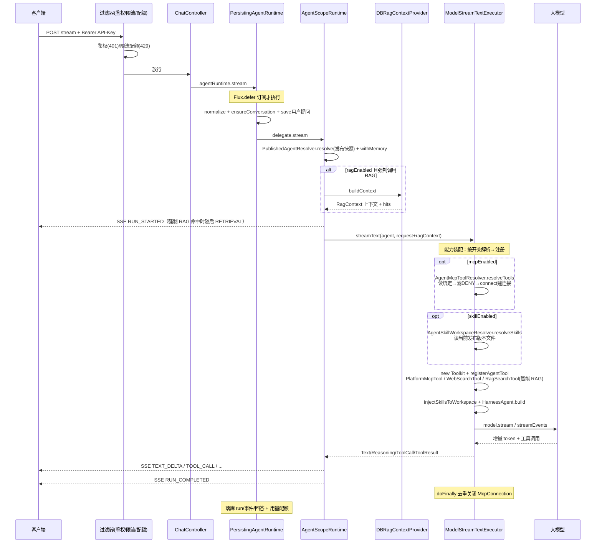
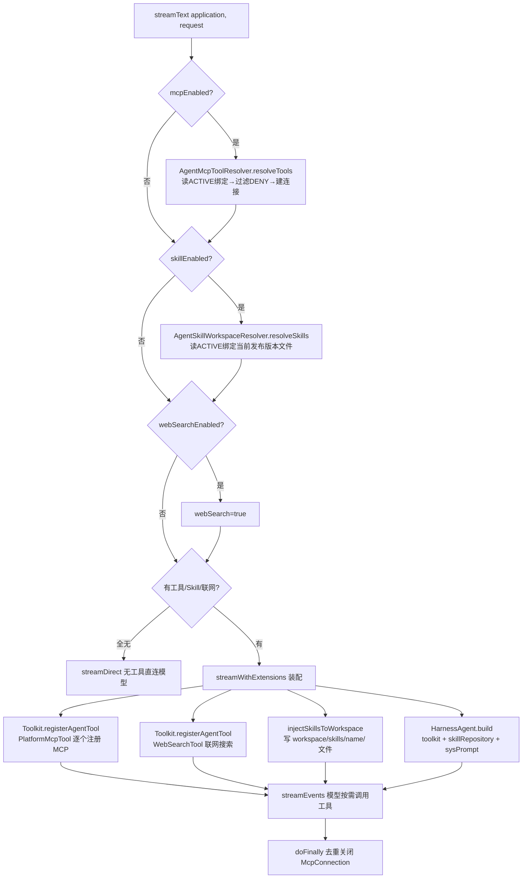
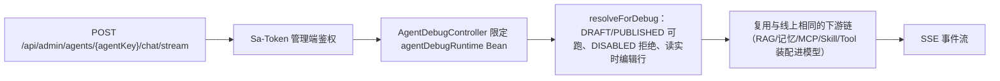

# v5ai-nb

基于 JDK 21、Spring Boot 4.1.0、AgentScope Java、MyBatis-Plus、PostgreSQL + pgvector 和 Sa-Token + JWT 构建的中心化 AI 应用平台。

## 许可证

本项目采用 [Apache License 2.0](LICENSE) 许可证。除非另有说明，项目中的源代码、文档和前端代码均按该许可证发布；第三方依赖仍受其各自许可证约束。

当前已完成 **Phase 1（模型与 Agent 闭环）**、**Phase 2（RAG 知识库）**、**Phase 3（MCP）**、**Phase 4（Skill）**、**Phase 5（平台增强）**及对话门户相关能力（Phase 6）；Workflow 已有管理 API 和基础运行模块，但可视化编排与完整运行时闭环仍在完善：

- 认证（Sa-Token + JWT）、Provider/Model 管理与凭据 AES-GCM 加密、模型连通性测试；
- **Agent**（原 Application 概念，V8 迁移重命名）：草稿/更新/禁用/发布版本、**系统提示词（systemPrompt）配置并随发布版本固化**、API Key 管理（BCrypt 存储）；
- AgentScope 运行时边界：流式/阻塞对话、SSE 平台事件（RUN_STARTED/MODEL_CALL/TEXT_DELTA/TOOL_CALL/TOOL_RESULT/PERMISSION_REQUIRED/MESSAGE_COMPLETED/RUN_FAILED/RUN_COMPLETED/RETRIEVAL 等）、会话/消息/run/run_event/AgentState 持久化、会话历史与恢复；
- RAG：知识库、文档上传（TXT/MD/PDF/DOCX）与 URL 导入、异步 Worker（解析 → 切片 → Embedding → pgvector 写入）、向量/关键词检索、运行时引用上下文注入与 RETRIEVAL 事件；
- MCP：Server 注册（Streamable HTTP / SSE / Stdio，headers/env 加密存储）、连接测试、Tool 发现与缓存、Agent 绑定、运行时动态 Tool 注册（AgentScope Toolkit）、Tool 权限三态（ALLOW/APPROVE/DENY）与调用审计（runId/工具名/参数摘要/状态/耗时）、Stdio 命令白名单；
- Skill：zip 包上传与结构校验（SKILL.md frontmatter、路径穿越/大小/编码）、版本发布与回滚（当前版本指针）、Agent 绑定、运行时 Workspace 注入（`skills/<name>/` + 只读 Skill 仓库注入 `<available_skills>`）、禁用；
- 平台增强：RBAC（角色 admin/user + 管理 API 登录拦截与写操作 admin 校验）、按应用配额与每分钟限流（超限 429）、模型调用用量记录与统计、管理操作审计日志、`/api/health` 与总览统计（可观测性）、启动自动种子默认管理员；
- 管理前端：登录、Provider/Model（凭据表单化 + 连通性测试）、Agent（模型下拉 + 知识库/MCP/Skill 绑定 + 生成 Key）、知识库管理、MCP Server 管理、Skill 管理、Platform（用户/角色/菜单）、Observability（统计/用量/审计）、Chat Debug。

## 技术基线

- JDK 21
- Spring Boot 4.1.0 / Spring MVC Servlet 栈（SSE 使用响应式流）
- MyBatis-Plus（显式装配 `SqlSessionFactory`，兼容 Spring Boot 4）
- Flyway
- Sa-Token + JWT
- BCrypt / AES-GCM
- PostgreSQL + pgvector（`vector(1536)` 余弦检索）
- AgentScope Java 2.0（`agentscope-harness`、`agentscope-extensions-model-openai/dashscope`）
- PDFBox 3.0.7（PDF 解析）

## 模块

- `v5ai-common`: 公共响应、异常、分页、API Key 校验端口和平台领域契约（用户/角色/菜单/配额/用量/审计/限流）
- `v5ai-model`: 模型配置与凭证加密、连通性测试端口
- `v5ai-agent`: Agent 草稿/更新/禁用/发布/版本解析核心
- `v5ai-runtime`: Agent 运行时边界、事件模型、会话/消息/run/AgentState 持久化装饰器、历史窗口裁剪（`v5ai.agentscope.history`）、会话摘要（`ConversationSummaryWriter`）、用量埋点（真实用量优先）、RAG 上下文端口；会话标题/摘要的模型取自 Agent 的**次要模型**（未配置则回退绑定的对话模型，见 `AuxiliaryModel`）
- `v5ai-rag`: 知识库/文档/任务领域模型、解析/切片/Embedding/向量存储端口、检索上下文构建
- `v5ai-mcp`: MCP Server/工具/审计领域模型、管理服务（连接测试、Tool 发现、Agent 绑定、权限）、连接与 Stdio 策略端口
- `v5ai-skill`: Skill 包解析校验、版本发布/回滚、Agent 绑定、运行时 Workspace 注入端口
- `v5ai-worker`: 文档索引 Worker（异步任务状态机 + `@Scheduled` 调度 + 重试）
- `v5ai-platform`: 平台自包含模块，提供认证、API Key、用户/角色/菜单、配额/用量/审计、资源存储管理及 Flyway 迁移；同时承载 MyBatis-Plus、Sa-Token、BCrypt、AES-GCM、pgvector、MinIO/Redisson 等平台实现
- `v5ai-api`: 跨模块 Web 装配、运行 API（SSE + API Key 限流/配额）、统计与健康接口、全局异常处理
- `v5ai-starter`: Spring Boot 启动模块（`scanBasePackages="xin.v5ai.nb"` + `@MapperScan` + `@EnableScheduling`）
- `v5ai-code-generator`: 独立的代码生成辅助模块，不参与默认启动链路
- `v5ai-ui`: Vue 3 + Vite + TypeScript + Naive UI 管理前端
- `v5ai-ui-chat`: 独立对话门户前端（终端用户侧，API Key 登录，独立部署）

## 运行时调用链路（RAG / MCP / Skill / Tool 装配）

> 一次运行从 HTTP 进来到 SSE 逐条推回，所有中间步骤都是同一条 Reactor `Flux` 链上的惰性执行（`Flux.defer` 在订阅时才真正开始）。强制 RAG 检索和 MCP/Skill/Tool 装配发生在模型首 token 之前；智能 RAG 以 `rag_search` 工具形式按模型决定是否调用，检索可能发生在模型开始输出之后。

### 1. 在线流式调用全链路（`POST /api/v1/agents/{agentKey}/chat/stream`）



### 2. 能力装配内部（`ModelStreamTextExecutor`）



### 3. 调试链路（`POST /api/admin/agents/{agentKey}/chat/stream`，`resolveForDebug`）

管理端调试接口与线上共享**同一条下游链**（同一个 `PersistingAgentRuntime` → `AgentScopeRuntime` → RAG/记忆/MCP/Skill/Tool 装配 → 模型），仅「鉴权方式」与「Agent 解析源」不同：

| 维度 | 线上 `/api/v1` | 调试 `/api/admin` |
|---|---|---|
| 端点 | `POST /api/v1/agents/{key}/chat/stream` | `POST /api/admin/agents/{key}/chat/stream` |
| 鉴权 | Agent API Key（`Bearer`，BCrypt 比对）+ 限流/配额 | 管理端 Sa-Token 登录（`/api/admin/**` 拦截），无需 API Key |
| 运行时 Bean | `agentRuntime` | `agentDebugRuntime`（`@Qualifier`，两个同类型 Bean 需显式限定） |
| Agent 解析 | `PublishedAgentResolver.resolve`：仅 `PUBLISHED`，读**发布版本快照** | `PublishedAgentResolver.resolveForDebug`：`DRAFT`/`PUBLISHED` 可跑，`DISABLED` 拒绝，读**实时编辑行** |
| 下游装配 | 相同 | 相同 |



关键差异：线上 `resolve()` 按 `publishedVersion` 找 `v5ai_agent_version.snapshot_json` 还原标量字段（对话模型/次要模型/系统提示词/5 个能力开关/RAG 调用方式/引用展示开关/展示字段），编辑未重新发布不影响线上；调试 `resolveForDebug()` 直接返回实时编辑行，便于在草稿态下预览/调试。MCP/Skill/RAG 绑定列表两路都不固化、仍按 `agentKey` 实时解析。

### 4. SSE 事件顺序

```
RUN_STARTED → RETRIEVAL(有 RAG 命中；强制调用在模型前，智能调用在 rag_search 的 TOOL_RESULT 之后) → MODEL_CALL
  → (TEXT_DELTA | REASONING_DELTA)* | (TOOL_CALL → TOOL_RESULT)*
  → MESSAGE_COMPLETED → RUN_COMPLETED
失败路径：RUN_FAILED；需授权：PERMISSION_REQUIRED；调用方停止：run 状态置 CANCELED（不额外发事件，已生成的部分回答照常落库）
```

### 5. 关键实现位置

| 环节 | 类 |
|---|---|
| 鉴权/限流/配额 | `AgentApiKeysServletFilter`（线上）；`/api/admin/**` 由 Sa-Token 拦截（调试） |
| 调试控制器 | `AgentDebugController`（`@Qualifier("agentDebugRuntime")`） |
| Agent 解析 | `PublishedAgentResolver.resolve` / `resolveForDebug` |
| 持久化装饰器 | `PersistingAgentRuntime`（先 save 用户提问，再 delegate；`doOnNext` 边推边落库） |
| 编排 + RAG/记忆门控 | `AgentScopeRuntime`（`ragEnabled` / `ragCallMode`：智能调用跳过前置检索、交执行器工具路径 / `memoryEnabled`） |
| RAG 检索（强制调用） | `DBRagContextProvider.buildContext` → `RetrievalContextBuilder.build`（向量 topK=4，空回退关键词，融合可选），模型前注入系统提示 |
| RAG 检索（智能调用） | `RagSearchTool`（工具名 `rag_search`，参数 `ragId` + `queryQuestion`）→ `DBRagContextProvider.search` → `RetrievalContextBuilder.search`（单库，校验 `ragId` 已绑定），命中 `TOOL_RESULT` 后追加 `RETRIEVAL` |
| 工具装配 | `ModelStreamTextExecutor.streamText` / `streamWithExtensions` |
| MCP 解析 | `AgentMcpToolResolver`（读 ACTIVE 绑定、滤 DENY、建连接） |
| Skill 解析 | `AgentSkillWorkspaceResolver`（读当前发布版本文件） |
| 联网搜索 | `WebSearchTool`（Tavily，`v5ai.agentscope.tavily-api-key`，缺 Key 返回错误） |
| 门户会话管理 | `ChatController`（列表/改名/归档/停止）+ `RuntimeConversationServiceImpl`（归属断言、归档拦截） |
| 附件上传/读取 | `ChatAttachmentController`（base64 + 文件头校验 + 按 Key 限流）；读取按「本 Key 引用过」推导式鉴权 |
| 多模态装配 | `ModelStreamTextExecutor.conversationMessages`（TextBlock + ImageBlock，最近优先 16MB 预算，超出退化为 `[图片]`） |
| 停止对话 | `RunCancellationRegistry`（按 runId 的取消信号）+ `PersistingAgentRuntime` 的 `doOnCancel` 兜底 |

## 配置项一览（`v5ai.*`）

配置项按使用频率分两张表：**常用**是部署与日常运行会调的项；**高级**多为安全、加解密、连接池与超时微调，多数场景保持默认即可。两表覆盖代码中全部 `v5ai.*` 配置项。

默认值取自 `v5ai-starter/src/main/resources/application.yml.template` 以及各 `@ConfigurationProperties` / `@Value` 的代码默认值；`${ENV:default}` 表示「优先读环境变量 `ENV`，未设置时用 `default`」，环境变量清单见仓库根 `.env.example`。

### 常用配置

| 编号 | 配置项 | 默认值 / 可选值 | 描述 |
|---|---|---|---|
| 1 | `v5ai.agentscope.workspace` | `${V5AI_AGENTSCOPE_WORKSPACE:.agentscope/workspace}` | Agent 工作区（Skill 文件注入目录） |
| 2 | `v5ai.agentscope.state-directory` | `${V5AI_AGENTSCOPE_STATE_DIR:.agentscope/state}` | Agent 状态目录（本地 `JsonFileAgentStateStore`） |
| 3 | `v5ai.agentscope.tavily-api-key` | `${V5AI_TAVILY_API_KEY:}`；空=不启用 | 联网搜索（Tavily）API Key |
| 4 | `v5ai.agentscope.reasoning-persist-enabled` | `true` | 是否把模型思考随助手消息落库（思考从不回放给模型） |
| 5 | `v5ai.agentscope.history.enabled` | `true` | 历史窗口裁剪开关（关闭=整个会话历史全发，长会话会顶爆模型窗口） |
| 6 | `v5ai.agentscope.history.maxMessages` | `40` | 单次运行保留的历史条数上限 |
| 7 | `v5ai.agentscope.history.maxChars` | `8000` | 历史正文字符上限（不含图片字节） |
| 8 | `v5ai.agentscope.history.minMessages` | `2` | 预算再紧也要保留的最近消息条数 |
| 9 | `v5ai.agentscope.history.alignToUserTurn` | `true` | 裁剪后首条若是助手回答则继续前丢，避免「没有提问的回答」 |
| 10 | `v5ai.chat.attachment.maxFileSizeBytes` | `5242880`（5MB） | 单张图片附件体积上限 |
| 11 | `v5ai.chat.attachment.uploadsPerMinute` | `20` | 每把 API Key 每分钟允许的上传次数（进程内滑动窗口） |
| 12 | `v5ai.chat.attachment.maxPerMessage` | `3` | 每条消息允许携带的图片数量上限 |
| 13 | `v5ai.chat.attachment.historyBudgetBytes` | `16777216`（16MB） | 历史回放中图片的累计体积预算（超出退化为 `[图片]` 占位） |
| 14 | `v5ai.chat.conversation-title.enabled` | `true` | 是否用模型改写会话标题（关闭则退化为首条提问兜底名） |
| 15 | `v5ai.chat.conversation-title.timeoutMillis` | `5000` | 单次标题生成超时（毫秒） |
| 16 | `v5ai.chat.conversation-title.maxLength` | `30` | 标题长度上限（码点） |
| 17 | `v5ai.chat.conversation-summary.enabled` | `true` | 会话摘要开关（关闭则历史窗口外内容直接丢弃） |
| 18 | `v5ai.chat.conversation-summary.timeoutMillis` | `20000` | 单次摘要生成超时（毫秒），超时保留旧摘要 |
| 19 | `v5ai.chat.conversation-summary.minNewMessages` | `10` | 水位之后至少新增多少条窗口外消息才再压一次 |
| 20 | `v5ai.chat.conversation-summary.maxInputMessages` | `100` | 单次喂给摘要模型的消息条数上限 |
| 21 | `v5ai.chat.conversation-summary.maxInputCharsPerMessage` | `500` | 单条输入消息的截断长度（字符） |
| 22 | `v5ai.chat.conversation-summary.maxSummaryChars` | `1000` | 摘要长度上限（字符） |
| 23 | `v5ai.chat.conversation-summary.minIntervalSeconds` | `30` | 同一会话两次摘要生成的最小间隔（秒） |
| 24 | `v5ai.storage.type` | `${V5AI_STORAGE_TYPE:LOCAL}`；可选 `LOCAL` / `MINIO` | 通用资源（`plm_resource`）存储类型 |
| 25 | `v5ai.storage.local-dir` | `${V5AI_STORAGE_LOCAL_DIR:./v5ai-upload}` | `LOCAL` 模式的存储根目录 |
| 26 | `v5ai.minio.endpoint` | `${V5AI_MINIO_ENDPOINT:http://localhost:9000}` | MinIO 服务地址 |
| 27 | `v5ai.minio.access-key` | `${V5AI_MINIO_ACCESS_KEY:minioadmin}` | MinIO Access Key |
| 28 | `v5ai.minio.secret-key` | `${V5AI_MINIO_SECRET_KEY:minioadmin}` | MinIO Secret Key |
| 29 | `v5ai.minio.bucket` | `${V5AI_MINIO_BUCKET:v5ai}` | MinIO 桶名 |
| 30 | `v5ai.model.connection.test.timeout.ms` | `${V5AI_MODEL_CONNECTION_TEST_TIMEOUT_MS:90000}` | 模型连通性测试与 Agent 配置生成超时（毫秒） |
| 31 | `v5ai.auth.refresh-token-ttl` | `43200` | 刷新令牌有效期（分钟，默认 30 天） |
| 32 | `v5ai.worker.scan-interval-ms` | `5000` | 知识库索引任务扫描间隔（毫秒） |
| 33 | `v5ai.worker.initial-delay-ms` | `10000` | 首次扫描延迟（毫秒） |
| 34 | `v5ai.worker.batch-size` | `5` | 单次扫描处理的任务数上限 |

### 高级配置

| 编号 | 配置项 | 默认值 / 可选值                                                     | 描述 |
|---|---|---------------------------------------------------------------------|---|
| 35 | `v5ai.security.excludes` | `[/api/v1/agents/**]`                                               | Sa-Token 免登录路径；运行 API 由 API Key 自行鉴权 |
| 36 | `v5ai.crypto.type` | `aes`；可选 `aes` / `sm4`                                           | 凭据（模型 API Key、MCP headers/env）加密实现 |
| 37 | `v5ai.crypto.secret-key` | `${V5AI_CREDENTIAL_CIPHER_KEY:tggsbeaGlYKF8JJ9eAaZixMkJIqaqhwe}` | 对称密钥（32 字节），生产必须通过环境变量替换 |
| 38 | `v5ai.crypto.iv` | 无默认值（可选，`type=sm4` 时必填）                                 | SM4 初始化向量 |
| 39 | `v5ai.mybatis-encryptor.enable` | `false`                                                             | MyBatis 字段级加解密开关（`@EncryptField`） |
| 40 | `v5ai.mybatis-encryptor.algorithm` | `BASE64`；可选 `DEFAULT` / `BASE64` / `AES` / `RSA` / `SM2` / `SM4` | 默认加密算法 |
| 41 | `v5ai.mybatis-encryptor.encode` | `BASE64`；可选 `BASE64` / `HEX`                                     | 密文编码方式 |
| 42 | `v5ai.mybatis-encryptor.password` | 空                                                                  | 对称算法密钥 |
| 43 | `v5ai.mybatis-encryptor.publicKey` | 空                                                                  | 非对称算法公钥 |
| 44 | `v5ai.mybatis-encryptor.privateKey` | 空                                                                  | 非对称算法私钥 |
| 45 | `v5ai.api-decrypt.enabled` | `true`                                                              | 全局接口加解密开关 |
| 46 | `v5ai.api-decrypt.headerFlag` | `encrypt-key`                                                       | 加密请求头标识 |
| 47 | `v5ai.api-decrypt.publicKey` | 内置示例公钥                                                        | 响应加密公钥（使用前请自行更换） |
| 48 | `v5ai.api-decrypt.privateKey` | 内置示例私钥                                                        | 请求解密私钥（使用前请自行更换） |
| 49 | `v5ai.captcha.enable` | `true`                                                              | 登录验证码校验开关 |
| 50 | `v5ai.captcha.type` | `slider`                                                            | 验证码类型（`slider`=图片滑块） |
| 51 | `v5ai.captcha.numberLength` | 无默认值（可选，`type=math` 时生效）                                | 数字验证码位数 |
| 52 | `v5ai.captcha.charLength` | 无默认值（可选，`type=char` 时生效）                                | 字符验证码长度 |
| 53 | `v5ai.captcha.slider-threshold` | `3`                                                                 | 登录错误次数达到该值后需先过滑块（须小于 `user.password.maxRetryCount`） |
| 54 | `v5ai.captcha.expire-minutes` | `2`                                                                 | 滑块拼图令牌有效期（分钟） |
| 55 | `v5ai.web.cors.allowCredentials` | `true`                                                              | 是否允许跨域携带凭证 |
| 56 | `v5ai.web.cors.allowedOriginPatterns` | `["*"]`                                                             | 允许的来源匹配规则 |
| 57 | `v5ai.web.cors.allowedHeaders` | `["*"]`                                                             | 允许的请求头 |
| 58 | `v5ai.web.cors.allowedMethods` | `["*"]`                                                             | 允许的请求方法 |
| 59 | `v5ai.web.cors.maxAge` | `1800`                                                              | 预检请求缓存时间（秒） |
| 60 | `v5ai.xss.enabled` | `false`                                                             | XSS 过滤开关（仅 `true` 时注册过滤器） |
| 61 | `v5ai.xss.excludeUrls` | `[]`                                                                | 跳过 XSS 过滤的请求路径 |
| 62 | `v5ai.agentscope.image-tokens-per-image` | `1024`                                                              | 用量估算中每张图片折算的 token 数（只影响估算兜底口径） |
| 63 | `v5ai.redisson.keyPrefix` | `${V5AI_REDIS_KEY_PREFIX:v5ai}`                                     | Redis key 前缀（profile 专属，见 `application-dev.yml.template`） |
| 64 | `v5ai.redisson.threads` | `4`                                                                 | Redisson 线程池数量 |
| 65 | `v5ai.redisson.nettyThreads` | `8`                                                                 | Redisson Netty 线程池数量 |
| 66 | `v5ai.redisson.singleServerConfig.clientName` | `${spring.application.name}`                                        | 客户端名称（单机模式） |
| 67 | `v5ai.redisson.singleServerConfig.connectionMinimumIdleSize` | `8`                                                                 | 最小空闲连接数 |
| 68 | `v5ai.redisson.singleServerConfig.connectionPoolSize` | `32`                                                                | 连接池大小 |
| 69 | `v5ai.redisson.singleServerConfig.idleConnectionTimeout` | `10000`                                                             | 连接空闲超时（毫秒） |
| 70 | `v5ai.redisson.singleServerConfig.timeout` | `3000`                                                              | 命令等待超时（毫秒） |
| 71 | `v5ai.redisson.singleServerConfig.subscriptionConnectionPoolSize` | `50`                                                                | 发布订阅连接池大小 |
| 72 | `v5ai.redisson.clusterServersConfig.*` | 可选（集群部署时替代 `singleServerConfig`）                         | 集群模式的主从连接池、读写模式与订阅模式配置 |
| 73 | `v5ai.mcp.stdio-command-whitelist` | `${V5AI_MCP_STDIO_COMMAND_WHITELIST:}`；空=不限制                   | Stdio MCP 命令白名单（逗号分隔，生产环境必须配置） |
| 74 | `v5ai.rag.smart-chunk.timeout-seconds` | `60`                                                                | 智能切片调用模型生成切片方案的超时（秒） |
| 75 | `v5ai.skill.ai.timeout-seconds` | `90`                                                                | Skill 内容 AI 生成调用超时（秒） |
| 76 | `v5ai.store.connection-test.timeout-seconds` | `5`                                                                 | 向量库 / 检索存储连通性测试超时（秒） |

文档解析服务的配置也通过环境变量注入。选择 `docling` 或 `mineru` 时，外部服务不可用、超时或返回空结果会记录 WARN 并回退到内置解析器；内置解析器失败才会使索引任务失败。

| 配置项 | 环境变量 | 默认值 |
|---|---|---|
| `v5ai.rag.parser.docling.enabled` | `V5AI_DOCLING_ENABLED` | `false` |
| `v5ai.rag.parser.docling.base-url` | `V5AI_DOCLING_URL` | `http://127.0.0.1:5001` |
| `v5ai.rag.parser.docling.api-key` | `V5AI_DOCLING_API_KEY` | 空 |
| `v5ai.rag.parser.docling.connect-timeout-millis` | `V5AI_DOCLING_CONNECT_TIMEOUT_MS` | `5000` |
| `v5ai.rag.parser.docling.read-timeout-millis` | `V5AI_DOCLING_READ_TIMEOUT_MS` | `600000` |
| `v5ai.rag.parser.docling.poll-interval-millis` | `V5AI_DOCLING_POLL_INTERVAL_MS` | `2000` |
| `v5ai.rag.parser.docling.poll-timeout-millis` | `V5AI_DOCLING_POLL_TIMEOUT_MS` | `1800000` |
| `v5ai.rag.parser.docling.concurrency` | `V5AI_DOCLING_CONCURRENCY` | `3` |
| `v5ai.rag.parser.mineru.enabled` | `V5AI_MINERU_ENABLED` | `false` |
| `v5ai.rag.parser.mineru.base-url` | `V5AI_MINERU_URL` | `http://127.0.0.1:8000` |
| `v5ai.rag.parser.mineru.connect-timeout-millis` | `V5AI_MINERU_CONNECT_TIMEOUT_MS` | `5000` |
| `v5ai.rag.parser.mineru.read-timeout-millis` | `V5AI_MINERU_READ_TIMEOUT_MS` | `600000` |
| `v5ai.rag.parser.mineru.poll-interval-millis` | `V5AI_MINERU_POLL_INTERVAL_MS` | `3000` |
| `v5ai.rag.parser.mineru.poll-timeout-millis` | `V5AI_MINERU_POLL_TIMEOUT_MS` | `1800000` |

`application.yml` 或 profile 专属配置可以覆盖上述模板默认值；生产部署请通过环境变量或外部配置文件设置服务地址，不要把凭据写入知识库配置或前端请求。

## 部署方式

### 1. 部署前准备

- Docker 24+ 与 Docker Compose v2+（Compose 部署方式会同时启动 PostgreSQL、pgvector、Redis 和 v5ai-nb）；
- 直接运行 jar 时，需要自行准备 PostgreSQL 14+（启用 pgvector）与 Redis；
- 生产环境必须替换 `V5AI_JWT_SECRET`、`V5AI_CREDENTIAL_CIPHER_KEY` 等密钥。`V5AI_CREDENTIAL_CIPHER_KEY` 必须是 32 字节，修改已使用过的密钥会导致历史模型凭据无法解密；
- 当前仓库内置的外部配置 profile 为 `dev`，可用 `SPRING_PROFILES_ACTIVE` 和环境变量覆盖。部署前请不要使用示例密码。

### 2. Docker 单容器部署

该方式只启动应用容器，PostgreSQL 与 Redis 使用已有的外部服务。构建上下文必须是仓库根目录：

```bash
docker build -f script/docker/Dockerfile -t v5ai-nb:latest .

docker run -d \
  --name v5ai-nb \
  --restart unless-stopped \
  -p 8080:8080 \
  -e SPRING_PROFILES_ACTIVE=dev \
  -e V5AI_DATASOURCE_URL=jdbc:postgresql://host.docker.internal:5432/v5ai_nb \
  -e V5AI_DATASOURCE_USERNAME=v5ai \
  -e V5AI_DATASOURCE_PASSWORD=change-me \
  -e V5AI_REDIS_HOST=host.docker.internal \
  -e V5AI_REDIS_PORT=6379 \
  -e V5AI_REDIS_PASSWORD=change-me \
  -e V5AI_JWT_SECRET=change-this-in-production \
  -e V5AI_CREDENTIAL_CIPHER_KEY=0123456789abcdef0123456789abcdef \
  -v "$(pwd)/config:/app/config:ro" \
  -v v5ai-upload-data:/data/uploads \
  v5ai-nb:latest
```

Linux Docker 主机如果不能解析 `host.docker.internal`，请改为数据库/Redis 的实际地址，或增加 `--add-host=host.docker.internal:host-gateway`。容器会自动读取挂载到 `/app/config` 的外部 Spring 配置。

常用操作：

```bash
docker logs -f v5ai-nb
curl http://127.0.0.1:8080/api/health
docker stop v5ai-nb
docker rm v5ai-nb
```

### 3. Docker Compose 部署

仓库提供的 Compose 文件位于 `script/docker/docker-compose.yml`，默认会创建并持久化 PostgreSQL、Redis、上传文件和 AgentScope 工作目录。先准备 Compose 环境变量，再启动：

```bash
cp .env.example .env
# 编辑 .env，至少替换 POSTGRES_PASSWORD、REDIS_PASSWORD、V5AI_JWT_SECRET、V5AI_CREDENTIAL_CIPHER_KEY
cd script/docker
docker compose --env-file ../../.env up -d --build
docker compose ps
docker compose logs -f v5ai
curl http://127.0.0.1:8080/api/health
```

Compose 专用变量如下：

```dotenv
POSTGRES_DB=v5ai_nb
POSTGRES_USER=v5ai
POSTGRES_PASSWORD=change-me
REDIS_PASSWORD=change-me
V5AI_PORT=8080
V5AI_JWT_SECRET=change-this-in-production
V5AI_CREDENTIAL_CIPHER_KEY=0123456789abcdef0123456789abcdef
```

停止应用但保留数据：

```bash
docker compose down
```

不要在生产环境随意执行 `docker compose down -v`，该命令会删除数据库、Redis、上传文件等命名卷。

### 4. 直接使用 jar 与启动脚本

不使用 Docker 时，可以使用 `script/shell/v5ai-nb.sh` 管理应用进程。脚本会优先查找发布目录下的 jar，其次查找 `v5ai-starter/target`，默认使用 `dev` profile、8080 端口，将日志写入 `logs/v5ai-nb.log`，并使用 `config/` 作为外部配置目录（目录存在时自动加载）。

如果只构建运行镜像，可先构建 jar，再使用 `v5ai-starter/Dockerfile`；该文件不包含 Maven 构建阶段：

```bash
mvn -pl v5ai-starter -am package -DskipTests
docker build -f v5ai-starter/Dockerfile -t v5ai-nb:latest v5ai-starter
```

需要一次完成编译和镜像构建时，使用 `script/docker/Dockerfile` 两阶段构建文件（见上面的 Docker 部署命令）。

```bash
mvn -pl v5ai-starter -am package -DskipTests
chmod +x script/shell/v5ai-nb.sh

./script/shell/v5ai-nb.sh start
./script/shell/v5ai-nb.sh status
./script/shell/v5ai-nb.sh restart
./script/shell/v5ai-nb.sh stop
```

可通过环境变量覆盖默认行为：

```bash
PROFILE=dev PORT=8081 JAVA_OPTS='-Xms1g -Xmx2g' \
  CONF_DIR=/etc/v5ai-nb JAR_PATH=/opt/v5ai-nb/v5ai-nb.jar \
  ./script/shell/v5ai-nb.sh start
```

需要注册为 systemd 服务时，使用 root 安装并指定运行用户：

```bash
sudo USER_NAME="$USER" ./script/shell/v5ai-nb.sh install
sudo systemctl start v5ai-nb
sudo systemctl status v5ai-nb
sudo journalctl -u v5ai-nb -f

# 卸载 systemd 服务
sudo ./script/shell/v5ai-nb.sh uninstall
```

### 5. 部署后检查

1. 访问 `GET /api/health`，确认应用、数据库和迁移状态正常；
2. 查看 `docker compose logs -f v5ai` 或 `logs/v5ai-nb.log`，确认 Flyway 没有失败；
3. 通过 `POST /api/auth/login` 登录管理端，首次启动自动创建的 `admin/admin` 仅用于开发验证，生产环境必须修改密码；
4. 配置 Provider、Model、Agent 与 API Key 后，再调用 `/api/v1/agents/{agentKey}/chat/stream` 验证运行链路。

## 本地验证

```bash
mvn -Dmaven.repo.local=/private/tmp/v5ai-m2 clean verify -Dsurefire.failIfNoSpecifiedTests=false
cd v5ai-ui
npm install
npm run build

# 对话门户（独立前端，可与管理端分别部署）
cd ../v5ai-ui-chat
npm install
npm run build
```

启动前需要 PostgreSQL（含 pgvector 扩展）与配置：

```bash
V5AI_DATASOURCE_URL=jdbc:postgresql://localhost:5432/v5ai_nb
V5AI_DATASOURCE_USERNAME=v5ai
V5AI_DATASOURCE_PASSWORD=change-me
V5AI_JWT_SECRET=change-this-development-secret
V5AI_CREDENTIAL_CIPHER_KEY=0123456789abcdef0123456789abcdef
```

启动后：

1. `POST /api/auth/login`（无用户时启动自动创建默认管理员 `admin/admin`，生产务必改密）获取管理员 Token；
2. 配置 Provider 与 Model（`POST /api/admin/providers`、`POST /api/admin/models`，可在 UI 上连通性测试）；
3. 创建并发布 Agent，再通过 `POST /api/admin/api-keys` 创建 API Key 并绑定可访问的 Agent；
4. 创建知识库、上传文档（`POST /api/admin/knowledge-bases/{kbId}/documents`，multipart），Worker 异步索引；
5. 将知识库绑定到 Agent（`POST /api/admin/agents/{agentKey}/knowledge-bindings`）；
6. 创建 MCP Server（`POST /api/admin/mcp-servers`）→ 测试连接 → 发现工具（`POST /api/admin/mcp-servers/{id}/discover-tools`）→ 绑定到 Agent（`POST /api/admin/agents/{agentKey}/mcp-bindings`）；
7. 上传 Skill 包（`POST /api/admin/skills`，multipart zip）→ 发布版本（`POST /api/admin/skills/{id}/versions/{versionId}/publish`）→ 绑定到 Agent（`POST /api/admin/agents/{agentKey}/skill-bindings`）；
8. 通过 `POST /api/v1/agents/{agentKey}/chat/stream`（Agent API Key）发起流式对话：带 RAG 上下文，MCP 工具被动态注册（调用记录可查 `GET /api/admin/mcp-tool-calls?runId=<run-id>`），绑定 Skill 自动注入 Workspace；
9. 在 Agent 管理列表的「配额」操作中配置应用配额/限流（`GET|PUT /api/admin/apps/{agentKey}/quota`），在可观测性页查看用量明细与总览（`GET /api/admin/usage`、`GET /api/admin/stats/overview`）；系统日志页使用 `GET /api/admin/oper/log/list` 查看操作审计。
10. 对话门户（`v5ai-ui-chat`）用 API Key 登录后可管理服务端会话并带图片提问：
    - `GET /api/v1/agents/auth/bootstrap` 拿到可用 Agent 与 `imageSupported`（所绑模型 `config.capabilities` 含 `image` 才为真）；
    - **附件入口的两个坑**：①判定用的是**发布快照**里的 `modelId`（`PublishedAgentResolver.resolve`），而能力本身按模型 ID 实时读——所以在「模型管理」里给模型开启「支持图片输入」无需重新发布即可生效，但**给 Agent 换了绑定模型必须重新发布**，否则门户仍按旧快照的模型判定；②`imageSupported` 只在进入页面时取一次，改完模型/能力后需**刷新页面（或重登）**才会重新取到；
    - 会话列表 `GET /api/v1/agents/{agentKey}/chat/conversations`（`?archived=true` 查归档）、改名/归档 `PATCH …/conversations/{id}`；
    - 图片先 `POST /api/v1/agents/resource/upload`（JSON + base64，≤5MB，文件头必须是 PNG/JPEG/WebP）拿 `id`，再随 `chat/stream` 的 `attachments` 提交；历史回放里的图片按 `GET /api/v1/agents/attachments/{id}` 取；
    - 停止生成：点停止即调 `POST /api/v1/agents/{agentKey}/chat/runs/{runId}/stop`（runId 取自 SSE 的 `id:` 字段）并断开本地流，run 落定为 `CANCELED` 且保留已生成的部分回答；
    - bootstrap 还下发 `showCitations`（Agent 的「引用展示」开关，默认开）：关掉后助手消息下方的「引用（N 条）」折叠块**不渲染**，但检索、`RETRIEVAL` 事件、引用随消息落库（`v5ai_message.metadata`）**全部照旧**（见 `docs/adr/0011-citations-toggle-is-display-only.md`）。它和「次要模型」一样取自**发布快照**，**改完必须重新发布**，且 bootstrap 每页面只取一次、需**刷新页面（或重登）**才拿到新值；管理端「预览与调试」走实时编辑行，改完当场可见。

说明：

- 未配置 EMBEDDING 模型时，向量化回退到确定性本地 Hash 嵌入（维度 1536），便于本地端到端验证；
- 数据库迁移：`v5ai-modules/v5ai-platform/src/main/resources/db/migration/`，当前到 V49（V42–V49 包含思考与消息元数据、Schema 注释、遗留表清理、引用展示、Agent 次要模型、解析器元数据、模型身份注释和菜单按钮权限）；迁移只增不改，改历史迁移必须 flyway repair；当前 schema 全貌见 `docs/db/schema.md`；
- MCP 运行时使用已发现的 Tool 元数据：先"发现工具"再"绑定 + 发布"，运行时才会注册工具；
- Skill 上传生成 DRAFT 版本，发布后成为"当前版本"，运行时注入当前版本文件（回滚改变当前版本）；
- Stdio MCP 命令受白名单限制（`V5AI_MCP_STDIO_COMMAND_WHITELIST`，生产环境必须配置）；
- 管理 API 现在强制登录（写操作需 admin 角色）；运行时 API 按应用配额/限流（超限 429）；
- 限流器为进程内实现（单实例），多实例部署需替换 Redis；Token 用量以模型回报的真实值为准（直连路径读 `ChatResponse.getUsage()`、工具路径累加 `ModelCallEndEvent.getUsage()`），服务端未回报时回退为平台估算（CJK 1 字 1 token、其余 4 字符 1 token）；同会话历史上限默认 40 条 / 8000 字符，超出部分由 `ConversationSummaryWriter` 压缩成摘要继续参与上下文；
- Workflow 当前已有管理 API、节点/边定义和基础运行状态模型；可视化编辑器与完整运行时闭环仍在完善。

更多说明见：

- `docs/deploy/dev.md`（开发环境部署文档）
- `docs/api/phase1.md`
- `docs/api/phase2.md`
- `docs/api/phase3.md`
- `docs/api/phase4.md`
- `docs/api/phase5.md`
- `docs/api/phase6.md`（对话门户：附件与多模态、会话管理、停止对话）
- `docs/adr/0006-api-key-scoped-conversations.md`（会话与附件以 API Key 为归属主体）
- `docs/phase1-verification-update.md`
- `docs/phase2-verification.md`
- `docs/phase3-verification.md`
- `docs/phase4-verification.md`
- `docs/phase5-verification.md`

## 许可证

本项目采用 [Apache License 2.0](LICENSE) 许可证。除非另有说明，项目中的源代码、文档和前端代码均按该许可证发布；第三方依赖仍受其各自许可证约束。
