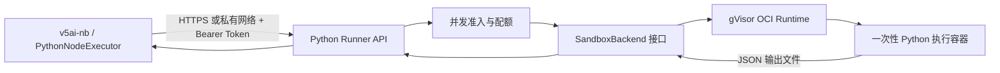

# Workflow Python Runner 实现设计

> 状态：待评审设计稿  
> 日期：2026-09-26  
> 范围：独立 Python Runner 服务、隔离执行后端及其与 v5ai-nb 的部署集成  
> 非目标：修改工作流引擎为异步队列、支持用户自装 Python 依赖、提供通用在线 Python IDE

## 1. 目标

为 Workflow 的 `PYTHON` 节点提供可独立部署的脚本执行服务。服务实现现有 Java 执行器所依赖的 HTTP 协议，并确保用户脚本只在一次性、受资源限制、默认无网络的隔离环境中执行。

目标用户是拥有工作流编辑权限的管理员。运行环境只提供平台预置的 Python 版本和依赖；首版不允许脚本调用 `pip` 安装软件包。

成功标准：

- Runner 与 v5ai-nb 通过私有 HTTP 网络通信，并用独立 Bearer Token 鉴权。
- 请求中的 `script` 和 `inputs` 只能作为不可信数据传给沙箱，不能控制镜像、命令、挂载、网络或资源参数。
- 每次执行使用新的临时工作目录和隔离执行实例；结束、超时或异常后均清理。
- 脚本可读取 JSON `inputs`，并以 JSON 对象 `outputs` 返回；现有编辑器默认脚本 `result = inputs` 可以兼容。
- 执行时长、并发、请求与结果大小及 CPU、内存、进程数均有服务端上限。
- Runner 未配置、不可用、过载或执行失败时，工作流有明确失败结果，不回退到 JVM/宿主机执行。

## 2. 仓库现状与兼容约束

当前 `PythonNodeExecutor` 位于 `v5ai-modules/v5ai-workflow`，读取配置：

- `v5ai.workflow.python.runner-url`
- `v5ai.workflow.python.runner-token`

每次执行目前同步调用 `GET /health`，然后 `POST /execute`。两个请求都带 `Authorization: Bearer <token>`。执行请求 JSON 当前包含：

```json
{
  "runId": "uuid",
  "nodeId": "python-node-id",
  "script": "result = inputs",
  "inputs": {
    "inputs": {"value": 21},
    "value": 21,
    "nodes": {}
  }
}
```

`inputs` 是 `WorkflowExecutionContext.snapshot()` 的完整工作流变量快照，不只是 START 入参。当前代码优先读取节点配置 `script`，兼容旧配置 `code`；`outputVar` 被设置为 Runner 返回的整个 `outputs` 对象。编辑器默认 Python 配置为 `code: "result = inputs"`、`outputVar: "result"`。

本设计保持上述端点、字段、同步调用方式和成功响应兼容。实现 Java 端时应明确 `script`/`code` 统一处理，并确认 `outputVar` 为空时仍只记录节点输出而不写入具名变量。Runner 路由前缀可以配置；默认根路径为 `/health`、`/execute`。

## 3. 方案比较与决策

### 方案 A：Python 服务在宿主机直接启动解释器

服务收到请求后调用本机 `python` 子进程。

- 优点：实现快、依赖少、启动快。
- 缺点：子进程继承服务账号的文件和网络权限；timeout 不能限制所有子进程、文件访问和系统调用；服务端 bug 可直接扩大宿主机影响。
- 决策：不用于可由工作流编辑者提交代码的部署。

### 方案 B：Runner API 为每次执行创建普通容器

控制面服务调用容器运行时，为每次脚本创建并销毁一个容器。

- 优点：Python 环境固定、资源控制成熟、对现有同步 HTTP 调用容易适配。
- 缺点：普通容器共享宿主机内核；Runner 控制面需获得容器创建能力，接口或运行时权限失守会有较大影响。
- 决策：开发环境可作为集成验证形态；生产运行时至少采用 rootless 容器运行时并叠加 gVisor 等隔离运行时，Runner 部署在专用 Linux 节点，不与 v5ai 主机共用宿主机权限。

### 方案 C：Kubernetes Job / Pod-per-execution

Runner 将每次执行提交为独立 Pod，由集群调度，设置 `RuntimeClass`、NetworkPolicy、Pod 安全上下文和 ResourceQuota。

- 优点：生命周期、并发和资源隔离交给编排平台；隔离策略可以集中管理。
- 缺点：依赖 Kubernetes；同步等待 Job 完成仍需处理轮询、断连、清理和超时；对当前 Compose 用户部署门槛较高。
- 决策：作为已有 Kubernetes 集群用户的生产部署适配，不作为仓库默认部署基线。

### 方案 D：WebAssembly/WASI 执行

- 优点：能力授权边界较清晰，可限制文件和系统能力。
- 缺点：用户已有 Python 包、原生扩展和常规 CPython 行为未必兼容，运行时与调试方式也需要新契约。
- 决策：不用于首版通用 Python 节点；将来可作为受限表达式/轻量脚本的另一种节点运行时。

**推荐：方案 B 的分层实现，生产通过 gVisor 运行一次性容器；保留容器后端接口，使 Kubernetes Job 成为可替换后端。**服务协议与执行后端解耦。普通 Docker 只用于本地开发和可信脚本的集成测试，不能标记为满足生产隔离验收。

## 4. 架构



Runner 服务分为两个逻辑部分：

1. **控制面 API**：鉴权、请求校验、准入控制、生成执行 ID、创建沙箱、等待结果、限制响应大小、审计脱敏状态并清理资源。
2. **沙箱执行后端**：实现 `SandboxBackend`，负责创建、等待、读取结果、强制停止和清理一次性环境。首版实现 OCI 容器后端，并要求生产配置指定 gVisor (`runsc`) runtime；不得从请求中接收容器参数。

API 与执行后端在安全边界上分离：API 只能提交固定模板定义的执行任务。容器运行时的管理接口只对 Runner 控制面开放，不暴露给 v5ai-nb、浏览器或脚本容器。Runner 部署节点不存放 v5ai 数据库、模型、MCP、对象存储或 API Key 凭据。

## 5. Python 脚本和数据契约

### 5.1 脚本约定

脚本在预置命名空间中执行，可读全局变量 `inputs`。脚本必须设置全局变量 `result`，其值必须为可 JSON 序列化的对象。Runner 将 `result` 作为 `outputs` 返回：

```python
result = {
    "discountedPrice": inputs["price"] * 0.9
}
```

现有默认脚本 `result = inputs` 仍合法。脚本不得通过 stdout 协议传回结果；stdout/stderr 仅作受限诊断信息，不返回给工作流变量。异常向调用端转换成稳定错误码和脱敏摘要，堆栈仅可在受控 Runner 日志中按配置记录，且不得包含 Token。

### 5.2 HTTP API

`GET /health`

- 必须验证同一 Runner Bearer Token。
- `200` 表示 API 已就绪且执行后端可用；返回中不包含运行时密钥、宿主路径或容器信息。
- readiness 检查可短暂缓存，不得在每次健康检查中启动脚本容器。

`POST /execute`

请求：

```json
{
  "runId": "uuid",
  "nodeId": "python-node-id",
  "script": "result = {\"value\": inputs[\"value\"] * 2}",
  "inputs": {"value": 21}
}
```

成功响应：

```json
{
  "outputs": {"value": 42}
}
```

错误响应采用统一结构 `{"error":{"code":"...","message":"..."}}`。状态码：`400` 请求结构无效、`401` Token 无效、`413` 请求体过大、`422` 脚本执行失败或输出无效、`429` 并发/配额达到上限、`503` 执行后端不可用、`504` 执行超时。Java 调用端应将非 2xx 映射成节点失败，并保留错误码供运行详情展示，不将 Runner 内部堆栈写入 API 响应。

### 5.3 输入输出限制

限制由 Runner 配置设定，节点传入的 `timeoutMs` 只能取不超过服务端最大值的值。建议首版默认：单次时限 30 秒、脚本最大 64 KiB、请求 JSON 最大 1 MiB、输出 JSON 最大 1 MiB、并发执行数 4；这些值需可配置并设不可被客户端突破的上限。超过限制分别以 413、422、429 或 504 返回。

执行容器只接触单次任务目录：`input.json` 只读、`script.py` 只读、`result.json` 可写。目录使用随机任务 ID 创建，完成后无条件清理；清理失败记告警并由启动时/定期回收器清理超过 TTL 的孤儿目录和容器。

## 6. 沙箱安全约束

以下是强制默认值，不允许请求参数覆盖：

- 每次调用创建全新容器，不复用 Python 解释器进程和工作目录。
- 非 root UID/GID；禁用提权；丢弃 Linux capabilities；默认 seccomp；启用 no-new-privileges。
- 生产使用 gVisor `runsc`；Runner 启动时校验运行时可用，不满足则 readiness 失败并拒绝执行。
- 禁网：容器 network namespace 不连外网、不连业务服务、不暴露宿主网络；容器内 loopback 不作为逃逸通道。
- 根文件系统只读；仅挂载本次输入和脚本只读目录、结果目录可写；临时目录使用有大小上限的 tmpfs 或等效临时存储。
- 不挂载 Docker/Podman socket、宿主根目录、SSH、云凭据、应用配置、环境变量密钥或其他任务目录。
- 设置硬 CPU、内存、PID、文件大小、打开文件数和执行时间限制；关闭 core dump；限制 stdout/stderr 和容器日志。
- 使用固定、不可由调用者指定的镜像 digest；预装依赖通过镜像构建发布，不允许运行时联网 pip。
- Runner API 仅内网可达；Token 用密钥管理注入，不进入仓库、镜像层、工作流 JSON 或日志；生产跨主机连接使用 TLS/mTLS 或等效私网安全传输。
- 请求中的 `runId`/`nodeId` 仅作追踪标记，先做长度和字符校验，不用于构造文件路径、容器名参数或 shell 命令。
- 由 Runner 使用结构化进程/容器 API 传入固定 argv；严禁拼接 shell 命令。

容器隔离不能宣称零风险。若服务面向外部租户运行任意恶意代码，应在专用 Linux 执行节点增加节点级隔离，并在安全验收后开放；高保证场景评估 Firecracker microVM 后端。运行 gVisor 或 Firecracker 不替代补丁、权限收敛、资源限制和网络策略。

## 7. 配置与部署

### 7.1 v5ai-nb 配置

在 `application.yml` 或部署环境中加入：

```yaml
v5ai:
  workflow:
    python:
      runner-url: ${V5AI_WORKFLOW_PYTHON_RUNNER_URL:}
      runner-token: ${V5AI_WORKFLOW_PYTHON_RUNNER_TOKEN:}
```

`runner-url` 为空或 Token 为空时维持 fail-closed。Compose 部署由 `.env` 提供私有服务地址和随机 Token，并分别写入 v5ai 服务和 Runner API 服务；不将 Token 提交到 `.env.example` 的真实值。

### 7.2 本地开发

- Runner API 和 v5ai-nb 放在仅内部可达的 Compose 网络，Runner 不发布宿主机端口。
- 开发机若无法运行 Linux gVisor（例如 Docker Desktop 环境），开发 Runner 必须显式标记为非生产后端，只允许无敏感数据的本地验证；启动日志和 `/health` 元数据不得将其报告为生产安全就绪。
- 不向 Runner 容器挂载 Docker socket。若开发后端需要控制本机容器，使用独立、专用 Linux VM/守护进程，并限定 Runner API 访问范围。

### 7.3 生产

推荐独立 Linux Runner 节点或专用 Kubernetes 节点池：

- 只允许 v5ai 应用节点访问 Runner API 端口；API 端口不经过公网负载均衡。
- Runner API 由非 root 用户运行；沙箱运行时使用单独 rootless daemon/专用节点身份。执行节点不部署 v5ai 主应用，也不保存其凭据。
- 主机安装并配置受支持版本的 gVisor OCI runtime；Runner 部署校验 runtimeClass/runtime 是否可创建并执行探针任务。
- 镜像由 CI 构建并按 digest 固定；升级需经过依赖变更审查、沙箱回归与镜像扫描。
- 通过运行时指标监控执行数、排队/准入拒绝数、超时数、容器启动失败、清理失败和资源峰值；不采集脚本全文或敏感输入。
- 部署支持优雅停止：停止接收新任务，等待当前任务到达短期限，随后强制终止并返回可识别失败；进程重启后回收孤儿资源。

Docker Compose 当前只覆盖 PostgreSQL/MySQL、Redis、v5ai 和 Nginx。此设计需为两份 Compose 增加 Runner API 配置，但隔离执行运行时应保留为独立部署单元/主机，不把宿主控制 socket 挂进现有 v5ai Compose。

## 8. 错误处理、并发与运行时行为

- Runner 对每个请求申请并发许可；达到上限立即返回 `429`，不在内存中无限排队。
- `POST /execute` 是有界同步调用以兼容当前 `PythonNodeExecutor`。容器执行时限必须小于 Java HTTP 请求时限，预留启动和清理时间。
- 客户端断连或请求取消时，Runner 应尝试终止对应容器并清理；执行容器有独立硬超时，确保 API 进程异常退出也不会留下无限运行脚本。
- Runner 自身不自动重试脚本，避免脚本产生的外部副作用被重复执行。
- 输出必须是 JSON 对象且可在服务端验证；禁止 NaN/Infinity、非字符串对象键和超过大小限制的值。
- 运行详情记录错误码、执行时长、镜像版本和资源限制摘要；脚本内容/完整输入默认不进入 Runner 日志。
- API 健康状态与执行后端健康分开测量；下游不可用时 `/health` 返回非 200，使现有 Java 执行器 fail-closed。

## 9. 实施拆分

1. **契约与 Runner 核心**：建立独立 `workflow-python-runner/` 服务目录，采用 Python 3 + FastAPI（仅控制面）；定义 Pydantic 请求/响应模型、Bearer 鉴权、配置校验、`/health`、`/execute`、错误码和 `SandboxBackend` 接口。
2. **隔离后端**：实现一次性 OCI 容器后端，固定镜像、只读输入输出挂载、禁网和资源限制；生产 profile 强制 gVisor，开发 profile 明确显示为非生产安全级别。
3. **打包与部署**：增加 Runner API Dockerfile、最小 Python 执行镜像和两方言 Compose 服务配置；Runner 默认不发布端口，配置通过环境变量/secret 注入，沙箱运行时仍独立管理。
4. **Java 端兼容完善**：配置文档化；修正/补充错误码解析、健康检查缓存、请求/响应大小上限和明确超时；保证 Runner 关闭时不发生本地执行回退。
5. **前端契约对齐**：明确脚本设置 `result` 对象的用法和默认模板；在 Python 节点说明预置依赖、时限和隔离后端状态。Runner 不可用时发布校验是否拦截由工作流验证阶段实现，本服务设计提供可用性探测接口。
6. **部署验收**：先在 Linux 测试节点验收 gVisor 资源与禁网配置，再发布部署说明和生产 Compose/Kubernetes 示例。macOS Docker Desktop 仅跑 API/协议开发，不作为生产隔离验收环境。

## 10. 验收标准

### 协议

- 无/错误 Token 的 `/health` 和 `/execute` 返回 401；正确 Token 的健康检查仅在后端可用时返回 200。
- 合法 JSON 请求返回 `outputs` 对象；旧编辑器默认 `result = inputs` 行为正确。
- 非法请求、过大脚本、过大输入输出、执行异常和超时分别返回约定状态码/错误码。
- 返回错误不含堆栈、密钥、宿主机路径或运行时控制接口详情。

### 隔离与资源

- 运行脚本不能访问公网、v5ai、业务数据库、Runner 管理接口或其他沙箱文件。
- 脚本无法读取服务 Token、主机敏感文件和其他任务输入。
- CPU、内存、PID、时限与临时磁盘限制可实际触发；超限任务被终止并清理。
- 并发超过上限时快速拒绝；Runner/主机重启后可回收孤儿容器和目录。
- 生产 profile 在 gVisor 不可用、镜像 digest 缺失或限制未生效时拒绝启动或保持未就绪。

### 集成与部署

- v5ai-nb 只能访问 Runner API；Runner 只通过配置的执行后端创建沙箱。
- PostgreSQL 与 MySQL Compose 中 Runner 配置一致，不影响现有服务启动路径；Runner 未配置时 Python 仍 fail-closed。
- 运行记录能够显示 Python 节点成功/失败、错误码与耗时，且日志不泄露脚本输入和 Token。

## 11. 风险和后续决策

- 当前工作流执行是同步请求链路。即使单次 Python 脚本时限为 30 秒，多节点工作流仍可能占用请求线程；是否把整个工作流转成 Worker 异步任务属于后续独立架构决策。
- 首版脚本只使用预装依赖。若要支持每工作流依赖，需要不可变依赖清单、镜像构建队列、缓存隔离、供应链扫描和版本锁定设计，不能开放运行时 `pip install`。
- 应在具体 Linux 发行版、内核版本和 gVisor 版本上进行资源限制及逃逸面验收。开发机的 Docker Desktop 行为不能替代生产主机验证。
- 当前 Java 客户端每次运行都请求 `/health`。实现时建议在 Java 侧短时间缓存 readiness 或移除每次调用前健康探测，避免额外 RTT 和 Runner 探活压力；业务执行仍以 `/execute` 结果为准。
- Runner API 进程若直接持有容器运行时控制权限，属于高价值控制面。必须部署在专用节点、严格限定其可创建任务模板，并监控控制接口权限；不能将宿主 rootful Docker socket 暴露给该服务。

## 12. 参考资料与代码

- Java 协议调用：[PythonNodeExecutor.java](../../../v5ai-modules/v5ai-workflow/src/main/java/xin/v5ai/nb/workflow/core/executor/PythonNodeExecutor.java)
- 工作流上下文快照：[WorkflowExecutionContext.java](../../../v5ai-modules/v5ai-workflow/src/main/java/xin/v5ai/nb/workflow/core/WorkflowExecutionContext.java)
- 编辑器 Python 配置：[WorkflowEditorView.vue](../../../v5ai-ui/src/views/WorkflowEditorView.vue)
- 现有 Compose 部署：[docker-compose-postgresql.yml](../../../script/docker/docker-compose-postgresql.yml)、[docker-compose-mysql.yml](../../../script/docker/docker-compose-mysql.yml)
- Docker 容器运行限制：[Docker run reference](https://docs.docker.com/reference/cli/docker/container/run/)
- Docker 无网络驱动：[Docker none network](https://docs.docker.com/engine/network/drivers/none/)
- gVisor OCI runtime：[gVisor documentation](https://gvisor.dev/docs/)
- Firecracker 生产部署：[Firecracker production host setup](https://github.com/firecracker-microvm/firecracker/blob/main/docs/prod-host-setup.md)
