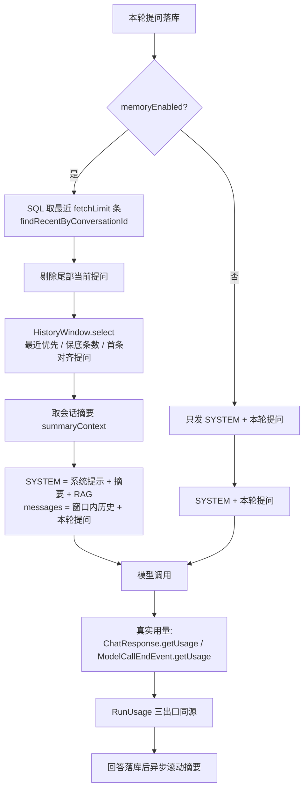

# 同会话短期记忆实现方案

> 状态：已实现并验证（2026-09-19）
> 范围：**同一会话内**的历史上下文治理（不含跨会话记忆）
> 关联文档：`会话上下文+记忆功能前期规划.md`（前期规划）、`api/phase6.md`（门户 API 契约）、`../CONTEXT.md`（术语「会话历史窗口」「会话摘要」）、`../AGENTS.md` §4/§5

---

## 一、要解决的问题

改造前，`memoryEnabled=true` 的实现是「把本会话**全部**未作废消息原样拼进模型请求」，由此带来三个具体问题：

| 问题 | 现象 | 根因 |
|---|---|---|
| **token 低估** | `v5ai_message` 的用量、`v5ai_model_usage` 明细与配额都偏低 | `PersistingAgentRuntime.usageOf()` 只按 `query + ragContext` 的字符数估算，既不含历史，也不含系统提示；且一律「4 字符 1 token」，中文长会话低估 3-4 倍 |
| **撑爆模型窗口** | 长会话某一轮突然整轮 `RUN_FAILED`，报上下文超限，且不会自愈 | 文本历史**没有任何条数/字符上限**：`findByConversationId` 无 LIMIT、`conversationMessages()` 全量拼 messages，平台侧没有裁剪也没有兜底 |
| **信息只能丢或全留** | 要么全发（爆窗），要么把老内容整段丢掉（模型失忆） | 缺少「窗口外内容压缩后继续携带」的机制 |

顺带修掉的两个既有缺口：

- 显式 `POST …/chat/conversations/{id}/resume` 由 `ChatController` 直接传入全量历史，**绕过**了任何预算；
- 老的 `withMemory` 只在「请求没带历史」时才读库，两条路径的裁剪口径不一致。

---

## 二、方案总览

三道机制协同：**计数**回答「花了多少」，**窗口**回答「发多少」，**摘要**回答「窗口外的怎么办」。



一次运行涉及的角色：

| 角色 | 职责 |
|---|---|
| `AgentScopeRuntime` | 解析 AgentDTO → 加载历史 → **过窗口** → 取摘要 → 发 `RUN_STARTED`（含窗口统计）→ 委托执行器 |
| `ModelStreamTextExecutor` | 拼系统提示（含摘要）与消息列表、发估算用量、收真实用量、映射工具/文本事件 |
| `PersistingAgentRuntime` | 消费内部用量事件、算最终用量、落库回答、触发标题改写与会话摘要 |
| `ConversationSummaryWriter` | 把窗口之外的新内容滚动压缩成摘要（异步、失败静默） |

---

## 三、① token 计数：真实用量优先，估算兜底

### 3.1 真实用量的两个来源

AgentScope 2.0.3 本来就回报用量，改造前被丢弃：

| 路径 | 数据来源 | 语义 |
|---|---|---|
| 直连（无 MCP/Skill/联网/智能 RAG） | `ChatResponse.getUsage()`（`ChatUsage`） | 整个流就是**一次**调用：用量通常只在最后一块上，若每块都带累计值则**取最后一次**（`TokenUsageAccumulator.setCall`） |
| 带工具（HarnessAgent） | `io.agentscope.core.event.ModelCallEndEvent#getUsage()` | 每次模型调用一条事件；工具循环会有**多轮**，逐条**累加**（`TokenUsageAccumulator.addCall`）——输入 token 是各轮提示词之和，这正是真实成本 |
| 兜底路径 `AgentScopeHarnessExecutor` | 返回消息上的 `Msg#getChatUsage()` | 同上，单次调用 |

`ChatUsage` 的 `cachedTokens` 是 `inputTokens` 的**子集**（不是额外量），因此累加 input/output 不会重复计费。

### 3.2 内部事件 `MODEL_USAGE`（不落库、不推前端）

执行器与 `PersistingAgentRuntime` 之间只有事件流这一条通路，因此用量靠内部事件传递：

```java
// AgentTextEvent（sealed）新分支
record Usage(long inputTokens, long outputTokens, boolean estimated) implements AgentTextEvent {}

// RuntimeEventType 新成员：MODEL_USAGE，载荷 {"inputTokens":n,"outputTokens":n,"estimated":bool}
```

- 执行器在 `MODEL_CALL` 之后**先发一条估算**（`estimated=true`，只带输入 token），再在每次模型调用结束后发**真实值**（`estimated=false`）；
- `AgentScopeRuntime.toRuntimeEvents` 把 `Usage` 映射为 `RuntimeEventType.MODEL_USAGE`；
- `PersistingAgentRuntime` 用内部的 `ReportedUsage` 累加后，**`.filter(event -> event.type() != MODEL_USAGE)` 把它从流里摘掉**：既不落 `v5ai_run_event`，也不会出现在 SSE 里（`ChatController` 是把整条流映射为 SSE 的，不摘就会外泄）。

### 3.3 估算兜底：CJK 感知（`PromptTokenEstimator`）

真实值缺失时（服务端不回报、或本轮在回报前就失败/被取消）按下面的口径估算：

| 内容 | 口径 |
|---|---|
| 中日韩文字、假名、谚文、全角符号与 CJK 标点 | **1 字 1 token**（主流分词器对 CJK 的压缩率接近 1:1） |
| 其余字符 | 每 4 个 1 token（向上取整） |
| 图片 | 按张计固定值 `v5ai.agentscope.image-tokens-per-image`（默认 1024）——`AttachmentRef` 没有宽高，做不了瓦片估算 |

取值优先级（`PersistingAgentRuntime.usageOf`）：**模型回报的真实值 → 执行器给出的估算（含系统提示与图片）→ 平台按请求字段估算**。

### 3.4 三个出口永远同源

同一次运行只算一次 `RunUsage`，同时供给：

1. `RUN_COMPLETED` 的事件载荷（前端「用量 / 用时」直接读）；
2. 助手消息落库（`v5ai_message.prompt_tokens/completion_tokens/duration_ms`，刷新页面后历史仍可见）；
3. `v5ai_model_usage` 明细 + 应用配额扣减。

### 3.5 代码位置

- `common-agentscope/core/token/PromptTokenEstimator.java`（估算口径）
- `common-agentscope/core/token/TokenUsageAccumulator.java`（累加语义）
- `common-agentscope/core/AgentTextEvent.java`、`enums/RuntimeEventType.java`、`domain/dto/RuntimeRunEventDTO.java#modelUsage`
- `common-agentscope/core/executor/ModelStreamTextExecutor.java`（两条路径的接线）、`AgentScopeHarnessExecutor.java`
- `runtime/core/PersistingAgentRuntime.java`（`ReportedUsage`、`usageOf`、过滤）

---

## 四、② 历史窗口：决定「发多少」

### 4.1 配置（`v5ai.agentscope.history`）

| 键 | 默认 | 说明 |
|---|---|---|
| `enabled` | `true` | 关闭后退回「全量历史」老行为；长会话会顶爆模型窗口，只建议排障时临时关 |
| `max-messages` | `40` | 保留的历史条数上限 |
| `max-chars` | `8000` | 保留的历史正文字符上限（不含图片字节） |
| `min-messages` | `2` | 保底条数，不受预算约束 |
| `align-to-user-turn` | `true` | 裁剪后首条必须是用户提问 |

### 4.2 算法（`HistoryWindow`，无状态纯函数）

```
select(history):
  若 条数 ≤ max-messages 且 总字符 ≤ max-chars  → 原样返回（trimmed=false）
  由新到旧累积 kept：
      停止条件 = kept.size() >= max-messages 或 keptChars + chars > max-chars
      注意：最新一条无论多长都要保留（!kept.isEmpty() 短路）——空上下文比超预算更糟
  保底：kept.size() < min-messages 时继续从新到旧补
  反转回时间正序
  边界对齐：kept 首条若是 ASSISTANT（没有对应提问的回答会让模型串味），继续往前丢
  返回 (kept, droppedMessages, droppedChars, keptChars)
```

裁剪结果里的统计口径是「相对**本次加载到的**历史」，不是「会话累计被裁掉多少」——后者由摘要水位表达。

### 4.3 落点：`AgentScopeRuntime#withMemory`（两条路一视同仁）

```java
var history = new ArrayList<>(request.history());          // resume 传入的历史
if (history.isEmpty()) {
    if (!agent.memoryEnabled() || messageService == null) return new MemoryPreparation(request, null);
    history = new ArrayList<>(messageService.findRecentByConversationId(
            request.conversationId(), historyWindow.fetchLimit()));
    if (!history.isEmpty() && history.get(history.size() - 1).role() == MessageRole.USER) {
        history.remove(history.size() - 1);                // Persisting 刚落的本轮提问，避免重复回放
    }
}
if (history.isEmpty()) return new MemoryPreparation(request, null);
var window = historyWindow.select(history);
return new MemoryPreparation(
        request.withHistory(window.messages()).withSummaryContext(loadSummary(agent, request)), window);
```

三个刻意点：

1. **`resume` 也过窗口**——否则它就是绕过预算的后门；
2. 剔除尾部用户消息**只按角色判定**、不比对文本：多模态下「相同文字、不同图片」的两条提问靠 content 无法区分；
3. 摘要只在 `memoryEnabled=true` 时携带（`loadSummary`）——它就是「本会话更早的历史」。

### 4.4 SQL 层先取一段（长会话不必读全表）

`HistoryWindow.fetchLimit()` 返回 `max(max-messages × 2, 20)`（不裁剪时返回 `-1`＝不限），运行时据此调用
`MessageService.findRecentByConversationId(conversationId, limit)`：按 `(created_at, id)` 倒序 + `LIMIT`，再反转回时间正序，
顺序口径与 `findByConversationId` 完全一致（同刻写入的提问与回答由自增主键兜底）。

多取一倍是给**边界对齐**留余量：取刚刚好会在丢掉首条 ASSISTANT 之后喂不满窗口。

### 4.5 可观测：`RUN_STARTED` 载荷

```json
{ "userMessageId": 123,
  "context": { "keptMessages": 12, "droppedMessages": 28, "droppedChars": 15230,
               "keptChars": 4210, "trimmed": true } }
```

- 未参与记忆（`memoryEnabled=false` 或没有历史）时载荷仍是空串，与改造前完全一致；
- `PersistingAgentRuntime.attachUserMessageId` 改为**合并字段**（`JSONUtil.parseObj(existing).set("userMessageId", …)`），否则会把窗口统计整体冲掉。

### 4.6 与图片预算的关系

窗口只管**文本**。历史回放中的图片仍走原来的 16MB 累计字节预算（`v5ai.chat.attachment.history-budget-bytes`），
按最近优先消费，预算用尽的图片连字节都不读、直接退化为 `[图片]` 占位。

---

## 五、③ 会话摘要：窗口外的内容不白丢

### 5.1 数据模型（`V41__conversation_summary.sql`）

```sql
create table if not exists v5ai_conversation_summary (
    conversation_id          varchar(36) primary key
                               references v5ai_conversation (id) on delete cascade,
    summary                  text        not null,
    covered_until_message_id bigint      not null,   -- 水位：id ≤ 该值的消息都已并入摘要
    covered_messages         int         not null default 0,
    model_id                 bigint,                 -- 生成摘要的模型（审计）
    created_at               timestamptz not null default current_timestamp,
    updated_at               timestamptz not null default current_timestamp
);
```

**一会话一行、滚动覆盖**，水位只增不减：

```sql
insert into v5ai_conversation_summary (...) values (...)
on conflict (conversation_id) do update
set summary = excluded.summary, covered_until_message_id = excluded.covered_until_message_id, ...
where v5ai_conversation_summary.covered_until_message_id < excluded.covered_until_message_id
```

把「谁更新」交给数据库而不是「先查后写」：摘要是异步生成的，同一会话可能同时有两次生成在跑，先查后写会让慢的那次把新摘要改旧。

### 5.2 生成时机与触发条件（`ConversationSummaryWriter`）

触发点在 `PersistingAgentRuntime.saveAnswerOnce`（与标题改写同一处、同样受 `answerSaved` 的 CAS 保护，因此取消路径也算「这一轮有结果」）。
调用本身是 fire-and-forget：`boundedElastic` 上执行、失败静默、**不记用量**（与 `ConversationTitleWriter` 同一性质）。

真正生成需要**依次全部满足**：

1. `v5ai.chat.conversation-summary.enabled=true`；
2. 该 Agent 的 `memoryEnabled=true`（记忆关着就根本不注入历史，摘要毫无用处——不白花一次模型调用）；
3. 距上次摘要 ≥ `min-interval-seconds`（默认 30 秒防抖）；
4. 会话确实超出窗口：对最近 `fetchLimit` 条做一次 `select`，取「窗口内最早那条」作为**边界**；没被裁过则直接返回；
5. 摘要水位还没到边界（`after >= boundary` 说明已覆盖，等新内容出窗口再说）；
6. 水位与边界之间**时间上最近**的 `max-input-messages`（默认 100）条里，条数 ≥ `min-new-messages`（默认 10）；
7. 能解析出模型 id（配置的固定模型优先，否则该 Agent 绑定的 CHAT 模型）。

> 为什么取「紧贴窗口起点的那一批」而不是最老的 backlog：这样摘要与窗口内历史**无缝相接**，模型读到的上下文是连续的；更早的内容本来就已经不在上下文里了。

### 5.3 摘要怎么生成

- 模型：`ModelChatClient.chatText(modelId, [SYSTEM, USER], timeout)`（复用标题改写的通道），`timeout-millis` 默认 20 秒；
- SYSTEM：要求保留「用户的目标与约束、已确认的结论与决策、关键实体（名称/编号/参数/数字/路径）、已完成与未完成事项」，丢弃寒暄与思考过程，只输出正文、不超过 `max-summary-chars`；
- USER：`【已有摘要】`（可为「（无）」）+ `【需要并入摘要的新内容】`（逐条 `[用户]/[助手]`，单条截断 `max-input-chars-per-message`＝500）；
- 清洗：去首尾空白 → 去掉模型可能加的「摘要：」等前缀 → 按 `max-summary-chars`（默认 1000）硬截断；为空则放弃本次；
- 写入：`upsertIfNewer(conversationId, summary, lastMessageId, coveredMessages + 本次条数, modelId)`。

### 5.4 注入位置

摘要走 `AgentRunBo.summaryContext`（服务端装配，**绝不接受请求体传入**），由 `ModelStreamTextExecutor.buildSystemPrompt` 拼进系统提示，
**在 RAG 上下文之前**（它是「本会话自己」的上下文，比外部知识更贴近当前对话），措辞明确「更早的消息已被裁剪，仅供你保持连贯，不要逐字复述」。
两条执行路径共用该处，因此直连与带工具的行为一致。

### 5.5 失效与级联

| 场景 | 行为 |
|---|---|
| 「重新生成」锚点早于摘要水位（摘要覆盖了被作废的问答） | `ChatController.regenerate` 在 `supersedeAfter` 之后调用 `invalidateIfCoveringAfter`，**整条摘要作废**，下次运行按当前有效历史重建 |
| 归档 / 取消归档 | 不删摘要（归档可逆） |
| 删除会话 | 表上的 `on delete cascade` 自动清理 |
| 删除 Agent | `AgentCleanupMapper.deleteConversationSummaries`（按 `conversation_id` 子查询），在删会话之前执行 |

### 5.6 为什么不用 SDK 自带的 `HarnessAgent.compaction(...)`

AgentScope 2.x 确实自带压缩栈（`CompactionMiddleware`、`ToolResultEvictionMiddleware`、`recoverFromOverflow`），但当前结构用不了：

1. **直连路径根本不构造 HarnessAgent**（`streamDirect` 直接 `model.stream`），要统一才能受益；
2. 每次运行都是 `new InMemoryAgentStateStore()` + `disableSessionPersistence()`，SDK 的压缩结果只活在本次运行的内存里，而我们的历史是每轮从 `v5ai_message` 重建的——摘要**无法跨轮复用**；
3. 摘要要能被「重新生成」作废、要随会话级联删除、要与多模态图片预算口径一致，这些都需要平台自己的持久化。

**后续可选（Phase 4）**：引入「会话级 `AgentStateStore` + 全路径统一走 `HarnessAgent`」，届时开启 `compaction` / `toolResultEviction`（大工具结果外置对 MCP 重型 Agent 收益最大）/ `recoverFromOverflow`（上下文超限自动压缩并重试一次）。

---

## 六、关键不变量

1. 发给模型的历史 **条数 ≤ `max-messages`**（除非保底/最新一条本身超预算），**正文 ≤ `max-chars`**；首条若是回答必被继续丢弃。
2. `resume`、普通追问、重新生成走**同一道窗口**，没有旁路。
3. `RUN_COMPLETED` 载荷 = 助手消息三列 = `v5ai_model_usage` + 配额，**同一份数字**。
4. `MODEL_USAGE` 对客户端不可见（既不在 SSE，也不在 `v5ai_run_event`）。
5. 摘要水位**只增不减**；重构摘要不会把新结果改旧。
6. 被作废的消息既不参与回放，也不被摘要覆盖（作废范围落在水位内时整条摘要作废）。
7. 摘要只在 `memoryEnabled=true` 的 Agent 上生成与注入。

---

## 七、代码地图

**新增（`v5ai-common-agentscope`）**

| 文件 | 作用 |
|---|---|
| `core/token/PromptTokenEstimator.java` | CJK 感知的估算兜底 |
| `core/token/TokenUsageAccumulator.java` | 真实用量累加（单次取最后、多轮求和） |
| `core/history/HistoryWindow.java`、`HistoryWindowResult.java` | 窗口裁剪纯函数与结果 |

**修改（`v5ai-common-agentscope`）**

| 文件 | 改动 |
|---|---|
| `core/AgentTextEvent.java` | 新增 `Usage` 分支 |
| `enums/RuntimeEventType.java`、`core/domain/dto/RuntimeRunEventDTO.java` | `MODEL_USAGE` 与工厂方法 |
| `core/domain/bo/AgentRunBo.java` | 新增 `summaryContext` 与 `withSummaryContext` |
| `core/executor/ModelStreamTextExecutor.java` | 发估算/收真实用量、系统提示注入摘要、消息列表只构建一次 |
| `core/executor/AgentScopeHarnessExecutor.java` | 从返回消息读真实用量 |

**新增（`v5ai-runtime`）**

| 文件 | 作用 |
|---|---|
| `core/ConversationSummaryGenerator.java`、`core/ConversationSummaryWriter.java` | 摘要端口与实现 |
| `core/config/properties/HistoryWindowProperties.java`、`ConversationSummaryProperties.java` | 两组配置 |
| `core/domain/ConversationSummaryDTO.java`、`core/service/ConversationSummaryService.java` | 读取载体与端口 |
| `domain/ConversationSummary.java`、`domain/vo/ConversationSummaryVo.java`、`mapper/ConversationSummaryMapper.java`、`resources/mapper/ConversationSummaryMapper.xml` | 持久化 |

**修改（`v5ai-runtime` / `v5ai-agent` / `v5ai-platform`）**

| 文件 | 改动 |
|---|---|
| `runtime/core/AgentScopeRuntime.java` | `withMemory` → 载入 + 窗口 + 摘要，窗口统计进 `RUN_STARTED` |
| `runtime/core/PersistingAgentRuntime.java` | 用量累加与过滤、载荷合并、摘要触发 |
| `runtime/core/service/MessageService.java`、`runtime/service/impl/RuntimeMessageServiceImpl.java` | `findRecentByConversationId`、`findActiveBetween` |
| `runtime/controller/ChatController.java` | 「重新生成」后摘要失效 |
| `runtime/core/config/AgentScopeRuntimeConfiguration.java`、`PortalConfiguration.java` | 装配 |
| `agent/mapper/AgentCleanupMapper.java`（+ XML）、`agent/service/impl/AgentDeletionServiceImpl.java` | Agent 级联清理 |
| `platform/.../db/migration/V41__conversation_summary.sql` | 摘要表 + 用量列注释修正 |

---

## 八、配置与迁移

```yaml
v5ai:
  agentscope:
    image-tokens-per-image: 1024      # 估算里每张图折算的 token（只影响兜底口径）
    history:
      enabled: true
      max-messages: 40
      max-chars: 8000
      min-messages: 2
      align-to-user-turn: true
  chat:
    conversation-summary:
      enabled: true
      model-id:                       # 留空 = 跟随该 Agent 绑定的 CHAT 模型
      timeout-millis: 20000
      min-new-messages: 10
      max-input-messages: 100
      max-input-chars-per-message: 500
      max-summary-chars: 1000
      min-interval-seconds: 30
```

- 迁移：`V41__conversation_summary.sql`（只增不改；顺带把 `v5ai_message` 用量列注释从「按字符数估算」改成「真实值优先」）。
- 灰度建议：先把 `conversation-summary.enabled` 打开但把 `min-new-messages` 调大（如 50）观察用量；出问题可单独关摘要（窗口仍在，不会爆窗，只是模型会忘记更早的内容）。

---

## 九、测试

| 测试类 | 覆盖 |
|---|---|
| `PromptTokenEstimatorTest`（6） | 空串、ASCII、CJK/全角/假名、混排、图片、按请求字段估算 |
| `HistoryWindowTest`（8） | 空历史、未超预算、条数裁剪、字符裁剪、保底条数、首条对齐（开/关）、不限窗口、取数上限 |
| `ModelStreamTextExecutorUsageTest`（3） | 直连路径「先估算后真实」、同调用取最后一次、无回报时只有估算、摘要进系统提示 |
| `ConversationSummaryWriterTest`（10） | 未超窗/未达阈值/水位已覆盖/防抖/记忆关闭 → 都不调模型；达阈值 → 清洗前缀并推进水位；模型异常 → 静默且不写；固定模型覆盖；取数上限 |
| `AgentScopeRuntimeSwitchesTest`（9） | 门控不变、窗口裁剪统计进 `RUN_STARTED`、`resume` 也被裁剪、摘要在开关开/关时的注入差异 |
| `PersistingAgentRuntimeTest`（14） | 真实用量优先（多轮累加）、`MODEL_USAGE` 不外泄不落库、`RUN_STARTED` 载荷合并保留 `userMessageId`、回答落库后触发一次摘要 |
| `ChatControllerTest`（19） | 重新生成作废后摘要失效；各类拒绝路径不触碰消息与摘要 |

> 跑测试务必带 `-Dmaven.test.skip=false`：根 pom 默认 `<maven.test.skip>true</maven.test.skip>`，不加这个参数 surefire 会「成功退出但一个用例都没跑」。

---

## 十、排障

| 现象 | 排查 |
|---|---|
| 模型「忘记」很久以前聊过的内容 | 是否只看到摘要：查 `v5ai_conversation_summary`，或看 `RUN_STARTED` 载荷的 `context.trimmed`；摘要没生成时确认 `memoryEnabled`、`min-new-messages` 与摘要模型是否可解析 |
| 每轮都在花一次摘要模型调用 | 检查 `min-new-messages` / `min-interval-seconds`；确认该 Agent 的 `memoryEnabled`（关闭时应完全不生成） |
| 明明开了记忆，模型却看不到历史 | 看 `RUN_STARTED` 的 `context.keptMessages` 是否为 0；`memoryEnabled=false` 时载荷是空串 |
| 用量明显高于/低于实际 | 真实值来自模型回报（`ChatUsage`）；如果服务端不回报，平台只能用 `PromptTokenEstimator` 估算，数字仅供参考 |
| 想临时恢复「全量历史」 | `v5ai.agentscope.history.enabled=false`（**不要长期开着**，长会话会直接 `RUN_FAILED`） |

---

## 十一、未做与后续

1. **跨会话记忆**：本方案只处理同会话。跨会话（同 API Key + 同 Agent 的长期记忆）尚未实现，`memoryEnabled` 目前**不**表示它。
2. ~~**Agent 级「小模型」字段**~~：**已落地（2026-09-21）**——`v5ai_agent.secondary_model_id`，供**会话标题**与会话摘要共用一个便宜的小模型（`AuxiliaryModel`，两级回退「次要模型 → 绑定的对话模型」）；原有的全局 `v5ai.chat.conversation-summary.model-id` 已**随之下线**。见 `docs/次要模型与引用展示开关实现方案.md`、`docs/adr/0010-agent-secondary-model.md`。
3. **SDK 压缩栈**：`HarnessAgent.compaction` / `toolResultEviction` / `recoverFromOverflow` 待统一执行路径与会话级状态存储后再评估（见 5.6）。
4. **摘要质量**：目前是「原文截断 + 一次压缩」，未做向量召回或二次提炼；摘要与窗口的预算也未按模型上下文窗口动态推导（`v5ai.agentscope.history` 是静态预算）。

---

## 十二、变更记录

| 日期 | 内容 |
|---|---|
| 2026-09-19 | 首版实现：真实用量优先的 token 计数、历史窗口裁剪（含 resume）、窗口外内容的滚动摘要；迁移 `V41`；文档同步到 `../AGENTS.md` / `../CONTEXT.md` / `../README.md` / `api/phase6.md` |
